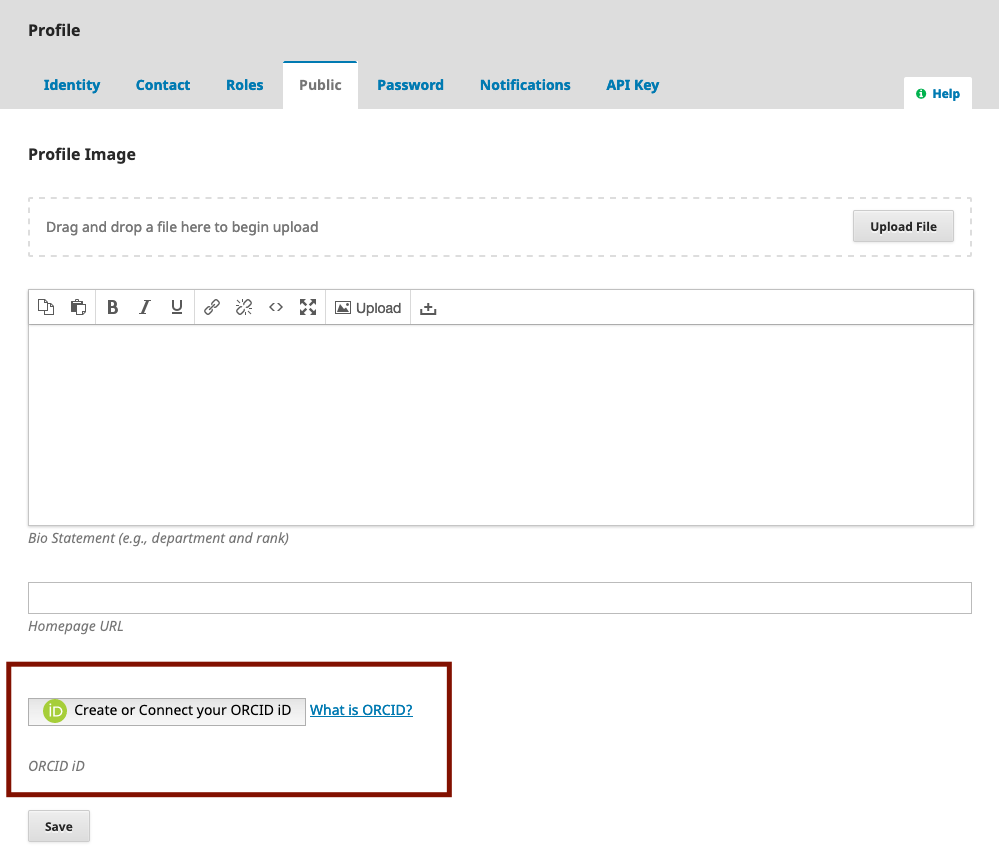
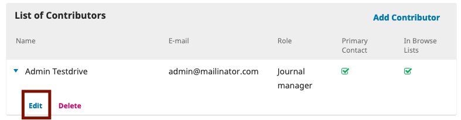

# Using the Plugin

ORCID iD can be connected by authors in their OJS accounts via an authorization requested by journal managers/editors or via an automated email sent upon issue publication (if enabled).

## For Authors

To register for an ORCID iD, visit [the ORCID registration page](https://orcid.org/register).

### Connecting Your ORCID iD and OJS

If you have an account in an OJS journal, you can connect your ORCID iD by logging into the journal and navigating to View Profile > Public. If the journal has setup the plugin, you will see a button that says ‘Create or Connect your ORCID iD’ (OJS version 3.1.2 and above). For previous versions of OJS, you will see a text field where you can manually enter your iD. When you click the button, you will be asked to sign into ORCID to authenticate your account.

## For Journal Managers/Editors

### Request ORCID authentication upon issue publication

You can configure the ORCID plugin settings to send an email automatically to authors requesting ORCID authorization when an article is published. See [Enable and Configure the ORCID Profile Plugin](./installation-setup#enable-and-configure-the-orcid-profile-plugin-in-ojs) in OJS for more information.

You can also request ORCID authorization from authors by doing the following:

1. Open the metadata for the article at any stage of the submission workflow.
2. Scroll down to contributors list.
3. Click on the contributor name whose ORCID authorization you want to request. ORCID iDs added without authentication will display an authentication request message (In OJS 3 versions previous to 3.1.2, it was possible to add unauthenticated ORCID ids).
4. Check off “Send email to request ORCID authorization from contributor.” This will send an automated email to the contributor asking them to authorize their ORCID iD.

