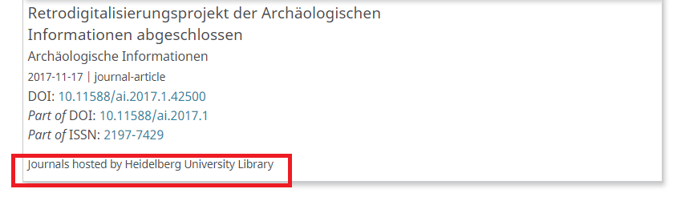

# Using the ORCID Plugin

Now that you have obtained ORCID credentials, enabled and set up the plugin, you can configure how you want to start using it in your journal / preprint server. Editors can manually or automatically invite authors to connect their ORCID and submitting authors can choose to connect their ORCID and invite other contributors to do so as well.

## Plugin functionality

Some of the following functions will happen automatically once the plugin is enabled and set up. Others require an additional action on editors’ or authors’ part to trigger.

### Authors can connect their ORCID iDs to their OJS accounts

Users (including submitting authors and contributors/co-authors) can do this in 2 ways:

* During a new account registration by clicking “Create or Connect your ORCID iD”

* For existing accounts - by clicking “Create or Connect your ORCID iD” in the Profile > Public.

Please note that if an author has connected their ORCID record to their OJS/OPS account, future articles and preprints they submit using the same account will be automatically connected to ORCID. However, if an author is a non-submitting contributor (co-author) on a submission, their OJS/OPS user account will not be automatically linked to the submission and they will need to respond to a request either from the editor or submitting author to connect the submission to their ORCID record.

### Editors can invite contributors to connect their ORCID iDs to the publication

To invite co-authors/contributors to connect their ORCID iDs, check the checkbox “Send email to request ORCID authorization from contributor” from the Contributor’s Edit screen. For details, see this [video walkthrough of contributor invitation](https://www.youtube.com/watch?v=ny0pue6MKek&t=843s).

To personalize the email sent to contributors, follow the instructions under [Email Templates](https://docs.pkp.sfu.ca/learning-ojs/en/settings-workflow#email-templates) to find the template : `ORCID_REQUEST_AUTHOR_AUTHORIZATION`

### ORCID plugin can send automatic request to contributors to connect their ORCID iDs

As an alternative to manually inviting contributors to connect their ORCID iDs, the Journal Manager/Administrator can configure the ORCID plugin to send out automatic emails to contributors. To do so, in the plugin email settings check the checkbox “Send email to request ORCID authorization from authors when an article is accepted”.

### ORCID plugin will display contributors' ORCID iDs on publication page

Authors' and contributors' authenticated ORCID iDs will be publicly displayed on the journal article or preprint page, which will link to the contributor’s ORCID record.

### ORCID plugin will display article information in author’s ORCID record (Member API only)

In addition to all of the above functionalities available in both Public and Member APIs, journals/preprint servers using ORCID Member API will automatically send article information to the author’s ORCID record upon publication. To see how the information displays, see the [video walkthrough of article publication with ORCID Member API](https://www.youtube.com/watch?v=ny0pue6MKek&t=170s).

When a work is added to an ORCID record, the “source” is displayed as well. If a person adds a work to their own record, the “source” will be the person’s name.

If a work is added via API, as in the case of OJS, the “source” will appear as whatever “client name” is entered when the [ORCID API credentials are requested](./installation-setup.md#request-public-api-credentials)

*Please note:* that the information on the source of the publication does not currently work for OPS.

### Review credits: ORCID plugin will display article information in reviewer’s ORCID record (Member API only)

Using the Member API, it is possible to send review details to a reviewer’s ORCID profile to give reviewers public credit for their work.

Note that in order for the ORCID plugin to send reviewer details to ORCID, the journal must first have an [ISSN entered in the Journal Settings](https://docs.pkp.sfu.ca/learning-ojs/en/journal-setup#masthead).

Reviewers must connect their ORCID manually from their Public Profile by using the “Create or Connect your ORCID iD” button. Currently there is no option for editors to send an invitation to reviewers to connect their ORCID, as they can for authors. Editors may wish to contact reviewers directly (using the “Notify” feature in OJS) with directions for authenticating their ORCID, as follows:

- Login to your user account in OJS
- In the top right, click Edit Profile
- Click on the Public tab, and click the “Create or Connect your ORCID iD” button
- Follow the steps to authenticate your ORCID iD with your OJS account
- Click Save

Once their ORCID is authenticated, the editor can invite the reviewer to complete their review. The editor can see which reviewers have their ORCID connected when they select “Add Reviewer”.

The reviewer now [completes their review](https://docs.pkp.sfu.ca/learning-ojs/en/reviewing) as normal and makes a recommendation for the submission.

Once the review is complete, the editor reads the review and clicks “Confirm.”

The editor can then select “Thank Reviewer,” which sends an (optional) email to the reviewer. Completing this step sends the article details to the reviewer’s ORCID record.

The review activity now appears on the reviewer’s ORCID record. Note that if the article used open peer review, the article title will appear under “Review subject.” If the article used anonymous peer review, the “Review subject” will not display.

### Alter an existing article to include an ORCID iD

At any point, editors can [send (or re-send) an invitation to a contributor to connect their ORCID iDs](./using-plugin#editors-can-invite-contributors-to-connect-their-orcid-ids-to-the-publication). Submitting authors can also send invitations, if they have permission to change article metadata (which includes contributor information).

### Remove an ORCID iD from a user account

There may be a situation in which you need to remove an author’s ORCID iD. This can only be done by an Administrator:

1. When logged in as an Administrator, on the left menu of OJS, select Users & Roles > Users
2. Locate the name of the user for whom you want to remove the ORCID iD. Click on the small arrow next to the person’s name and select Edit User
3. Once you are in the Edit User page, click on More User Details
4. Find the ORCID iD box and delete the ORCID iD
5. Click OK at the bottom of the page

## Inform your stakeholders

Once your ORCID plugin is enabled and in production, you might want to let your stakeholders (authors, journal editors, etc.) know that the ORCID plugin is now available, and make sure they know what ORCID is and how it can help them. There are a variety of ways to do this. One such way is by using the [OJS Announcements feature](https://docs.pkp.sfu.ca/learning-ojs/en/settings-website#announcements) to announce to registered users that the ORCID plugin is in use. As a part of such an announcement you may wish to point users to the [About the ORCID plugin page](./introduction.md) in case they are unfamiliar with ORCID. If you want to encourage reviewers to [add their review credits to their ORCID profiles](./using-plugin.md#review-credits-orcid-plugin-will-display-article-information-in-reviewers-orcid-record-member-api-only) (Member API only), you may also consider adding a mention of ORCID when you thank the reviewer after they have completed the review. If your journal has a social media presence or newsletter you can also inform users through those means as well.
