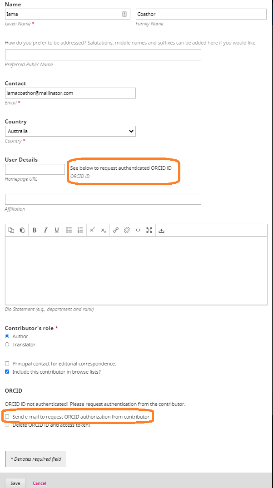

# Usando o Plugin ORCID

Agora que você tem [as credenciais ORCID obtidas, ativou e configurou o plugin](./installation-setup.md), você pode começar a usá-lo no servidor de pré-impressão de seu diário.

## Informar seus interessados

Uma vez que o seu plugin ORCID está ativado e em produção, você pode querer deixar seus stakeholders (autores, editores de periódicos, etc.) saberem que o plugin ORCID está disponível agora, e certifique-se de que eles sabem o que é ORCID e como ele pode ajudá-los. Há várias maneiras de o fazer. Uma dessas maneiras é utilizando o [recurso de Anúncios OJS](https://docs.pkp.sfu.ca/learning-ojs/en/settings-website#announcements) para anunciar aos usuários registrados que o plugin ORCID está em uso. Como parte de tal anúncio, você pode querer apontar usuários para a página do plugin [Sobre a página do plugin ORCID](./introduction.md) caso eles não estejam familiarizados com ORCID. Se o seu diário tem uma presença nas redes sociais ou uma newsletter você também pode informar os usuários por meio desses meios.

## Plugin functionality

The ORCID plugin allows to perform the functions outlined below. Some of these will happen automatically once the plugin is enabled and set up. Others require an additional action on editors' or authors' part.

### Authors can connect their ORCID iDs to their OJS accounts

Users (including authors and contributors) can do this in 2 ways:

* During a new account registration by clicking “Create or Connect your ORCID iD”

* For existing accounts - by clicking “Create or Connect your ORCID iD” in the Profile > Public. For details, see this [video walkthrough of profile authentication](https://vimeo.com/374415404).

Please note that if an author has connected their ORCID record to their OJS/OPS account, future articles and preprints they submit will be automatically connected to ORCID, providing they login to the site using their existing author account. However, if an author is a contributor (or co-author) on a submission, their OJS/OPS user account will not be linked to the submission and they will need to be prompted to connect the submission to their ORCID record.

### Editors can invite contributors to connect their ORCID iDs to the publication

To invite co-authors/contributors to connect their ORCID iDs, check the checkbox "Send email to request ORCID authorization from contributor" from the Contributor’s Edit screen. For details, see this [video walkthrough of contributor invitation](https://vimeo.com/374416189).

### ORCID plugin can send automatic request to contributors to connect their ORCID iDs

As an alternative to manually inviting contributors to connect their ORCID iDs, the Journal Manager/Administrator can configure the ORCID plugin to send out automatic emails to contributors. To do so, in the plugin email settings check the checkbox "Send email to request ORCID authorization from authors when an article is accepted".

### ORCID plugin will display contributors' ORCID iDs on publication page

Authors' and contributors' authenticated ORCID iDs will be publicly displayed on the journal article or preprint page, which will link to the contributor’s ORCID record.

### ORCID plugin will display article information in author’s ORCID record (Member API only)

In addition to all of the above functionalities available in both Public and Member APIs, journals/preprint servers using ORCID Member API will automatically send article information to the author’s ORCID record upon publication. For details, see the [video walkthrough of article publication with ORCID Member API](https://vimeo.com/374417678).

When a work is added to an ORCID record, the "source" is displayed as well. If a person adds a work to their own record, the "source" will be the person's name. If a work is added via API as in the case of OJS, the "source" will appear as whatever "client name" is entered when the ORCID API credentials are requested. If the ORCID plugin is being used for just a single journal, the source/client name is usually just the name of the journal. If the ORCID plugin is used for multiple journals on the same instance, then the source/client name would need to be something more broad, like "Univ. of XYZ Open Journals."

*Please note:* that the information on the source of the publication does not currently work for OPS.

### Alter an existing article to include an ORCID iD

For a visual overview of this process, see the [video walkthrough of article publication](https://vimeo.com/374417678).

### Remove an ORCID iD from a user account

There may be a situation in which you need to remove an author’s ORCID iD. This can only be done by an Administrator:

1. When logged in as an Administrator, on the left menu of OJS, select Users & Roles > Users
2. Locate the name of the user for whom you want to remove the ORCID iD. Click on the small arrow next to the person’s name and select Edit User
3. Once you are in the Edit User page, click on More User Details
4. Find the ORCID iD box and delete the ORCID iD
5. Click OK at the bottom of the page
