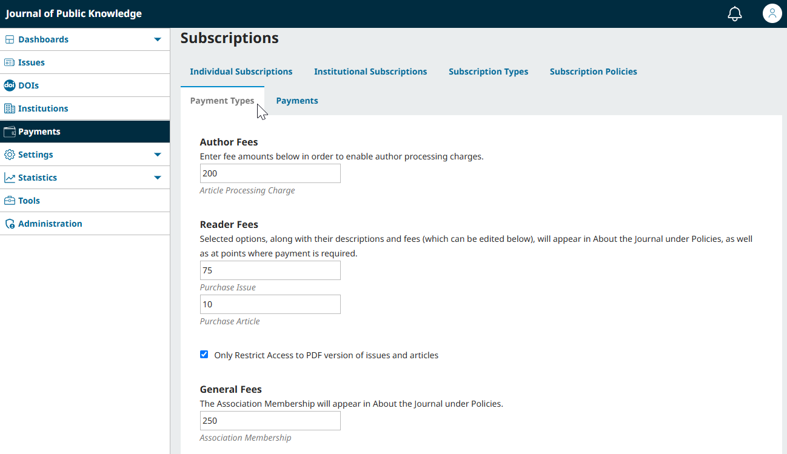

## Configure Author, Reader, and Other Fees {#set-fees)

To set the amounts for different types of fees such as author and reader fees, go to the Payment Types tab of the Payments Menu.



This PKP School video explains how to set up different payment types in your journal. To watch other videos in this series, visit [PKP’s YouTube channel](https://www.youtube.com/playlist?list=PLg358gdRUrDVTXpuGXiMgETgnIouWoWaY).

>Make sure you’ve already configured your payment method and plugins as per  [Enable and Configure Payments](#payment-settings) before proceeding. If these configurations are not complete, you will not be able to request payment of fees.
{:.warning}

### Request Author Fees (APCs) {#author-fees}

If you want to charge an article processing charge (APC) to authors, enter the amount in the Author Fees field. Enabling Author Fees will allow you to request an article processing charge after the review process has been completed. 

When the article is accepted by an Editor following Review, the Editor will have the option to request or waive this payment.

Choosing to request the publication fee will send an OJS notification and an email to the author directing them through the payment process.

You can also access the Payment tab on the manuscript dashboard to update the payment status of Author fees. Manuscripts can only be scheduled to an issue for publication once the Author fee has been marked as Paid or Waived.

### Request Reader Fees for Access to Selected Articles and Issues  {#reader-fees}

If you want to charge fees to access individual articles and issues, you can enter the prices for articles and issues in the Readers Fee fields.

You can apply the fees to PDF files only by checking off "Only Restrict Access to PDF version of issues and articles".

>Note that in order to charge a fee for access to an issue, you will need to upload an issue galley.
{:.notice}

### Request Other Types of Fees  {#general-fees}

Use the General Fees field to charge other fees, such as memberships.
