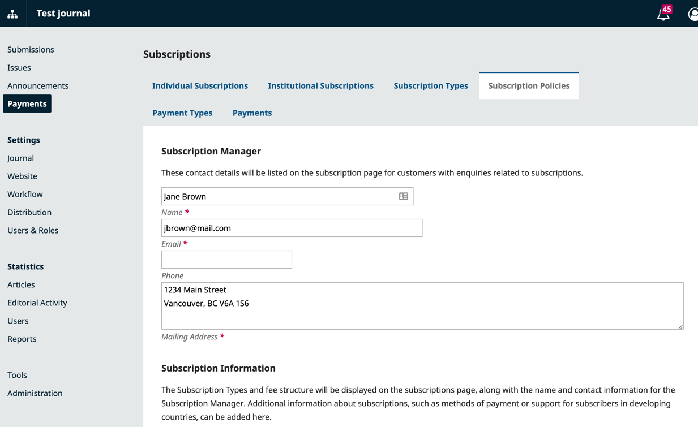

## Configure Subscription Policies {#subscription-policies}

Access Payments from the left side menu to begin configuring your subscription settings.

First, navigate to the Subscriptions Policies tab to fill in details about your subscription policies.

- **Subscription Manager**: Add personal details for the responsible person.
- **Subscription Information**: Add policy details to display on the journal website.
- **Subscription Expiry**: Determine whether past subscribers should continue to have access to older content.
- **Subscription Expiry Reminder**: Configure automated renewal reminders.
- **Online Payment Notifications**: Keep the Subscription Manager informed of payment activities.
- **Open Access Options for Subscription Journals**: If appropriate select the number of current months for restricting access. Older content will be automatically made open.
