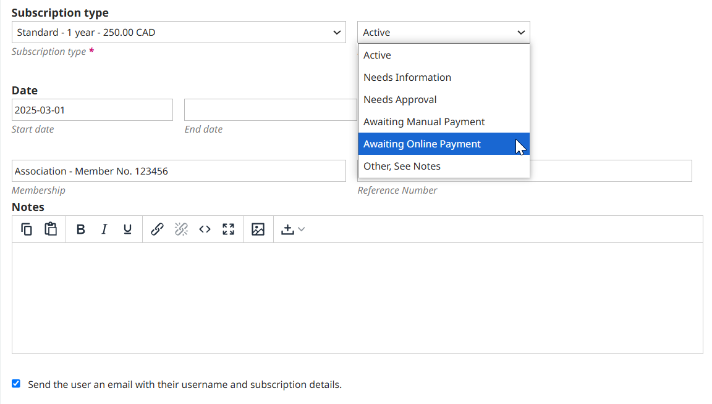
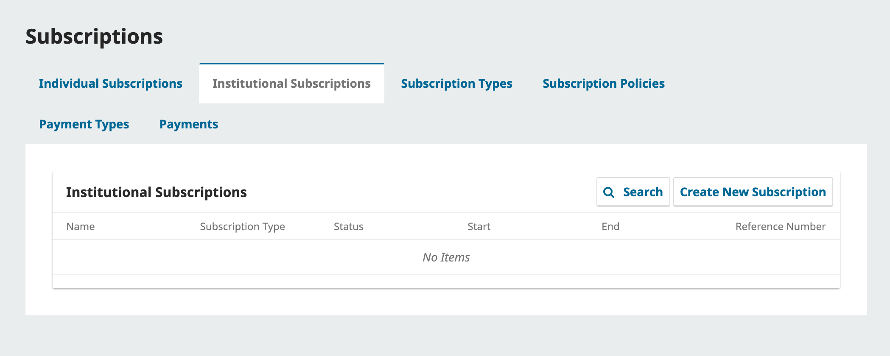

The next step will be to access the Subscription Types tab to designate the types of subscriptions your journal offers.

Journals typically offer both individual subscription and institutional subscription rates. Some journals may have special offers for members of an organization or students. OJS supports the management of print and/or online subscriptions. More than one type of subscription can be created to cover longer periods of time (12 months, 36 months).

Select **Create New Subscription Type** to add a new one.

* **Name of Type**: Give this new subscription type a unique name (e.g., Student).
* **Description**: Provide an optional brief description that will appear on the website.
* **Cost**: Select the currency type and amount.
* **Format**: Choose the appropriate format (e.g., Online).
* **Duration**: Enter the number of months this type of subscription will cover (e.g., 12).
* **Subscriptions**: Indicate whether this type covers individuals or institutions.
* **Options**: Choose whether the subscription requires proof of membership or if the subscription type will not be publicly available (e.g. when creating free subscription types that act as a waiver).

>Note: The information in this guide is applicable to OJS/OMP/OPS versions 3.4 and 3.5. For information on Managing Subscriptions in an earlier version, please refer to the relevant chapter in [Learning OJS 3.3](https://docs.pkp.sfu.ca/learning-ojs/3.3/en/subscriptions) or the appropriate version.
{:.notice} 

Once you’ve created your subscription policies and subscription types, you can create, manage, and edit subscriptions using the Individual Subscriptions and Institutional Subscriptions tabs in the Payments menu.

### Manage Individual Subscriptions {#individual-subscriptions}

The Individual Subscriptions tab is where you can see and manage individual subscriptions.

Click the Create New Subscription button to create a new individual subscription for an existing user. If the user has not already registered, use the invite feature in Settings - Users & Roles or ask them to register on the journal site. 

This will open the Create New Subscription window where you will enter the details of the subscription.

Select the relevant user and fill out the following details:

* **Subscription Type**: Choose a subscription type and the appropriate status (e.g., Active).
* **Date**: Set the start and end dates for this subscription.
* **Membership** (Optional): If the subscriber is associated with any relevant memberships, add that information here.
* **Reference Number** (Optional): If the subscription is associated with any relevant reference number (such as an invoice number for payment), you can add that information here.
* **Notes** (Optional): Add any notes for your reference.

Lastly, you can choose to notify the subscriber by email of their subscription details.

To make any changes to these details, renew a subscription, or delete a subscription, click the blue arrow next to the subscription and select the relevant option.

**Edit**: Edit the details of the subscription.
**Renew**: Extend the end date of the subscription by the duration of the subscription type. For example, if a subscription type lasts 12 months, the end date will be moved ahead by one year.
**Delete**: Delete the subscription.

### Manage Institutional Subscriptions {#institutional-subscriptions}

In order to create subscriptions that will grant access to members of libraries, research institutes, and other organizations that subscribe to your journal, you will need to do the following:

[Create an institutional Subscription Type](#subscription-types)
Register an institution in the Institutions tab
Create an Institutional Subscription associated with the institution

After creating your institutional subscription type, navigate to the Institutions tab on the left side menu.

Click the Add Institution button. This will open the Add Institution window. Here, you’ll be asked to enter:
* **Name**: The name of the institution, e.g. Simon Fraser University.
* **IP Ranges* (Optional)*: IP ranges associated with the institution. This information should be provided by the institution. Readers using a computer in this IP range will automatically receive access when a subscription associated with the institution is active. Each IP range should be entered as a new line.
* **ROR**: Enter the [Research Organization Registry ID](https://ror.org/) associated with the institution, e.g. https://ror.org/0213rcc28 

Click Save. Added institutions can be edited or deleted from the list at any time.

>Registering an institution’s IP ranges also provides benefits for journals who wish to track institutional access statistics.
{:.tip}

After registering an institution, return to Payments and navigate to the Institutional Subscriptions tab.

Click the Create New Subscription button to create a new institutional subscription for an existing user. If a contact from the institution has not already registered, use the invite feature in Settings - Users & Roles or ask them to register on the journal site.

This will open the Create New Subscription window where you will enter the details of the subscription..

Select the relevant institutional contact and fill out the following details:

* **Subscription Type**: Choose a subscription type and the appropriate status (e.g., Active).
* **Date**: Set the start and end dates for this subscription.
* **Institution**: Select the relevant institution you created earlier (e.g., Simon Fraser University Library).
* **Mailing Address** (Optional): Add the mailing address of the institution.
* **Domain** (Optional): Specify the domain of the institution (e.g., sfu.ca) to automatically grant access to users accessing the journal from that domain.
* **Reference Number** (Optional): If the subscription is associated with any relevant reference number (such as an invoice number for payment), you can add that information here.
* **Notes** (Optional): Add any notes for your reference.

Institutional subscriptions can be edited, renewed, and deleted exactly like individual subscriptions.

