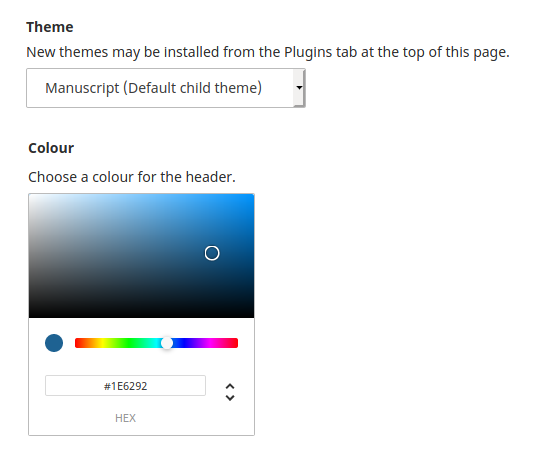

# Theme Options API Documentation

Theme options allow you to offer theme-specific configuration settings. They are most often used to provide color and font selections so that a journal can adapt a theme to their brand.

Options added to a theme will appear under the theme selection in the Settings > Website > Appearance > Theme  section.



## Add a theme option

All theme options should be configured in the `init()` method of your theme. The example below will create a color picker, add it to the settings when your theme is selected, and provide a default value to be used when the user has not selected one.

```php
public function init() {
    $this->addOption('baseColour', 'FieldColor', [
        'label' => __('plugins.themes.default.option.colour.label'),
        'description' => __('plugins.themes.default.option.colour.description'),
        'default' => '#1E6292',
    ]);
}
```

Add an option to select from a list.

```php
public function init() {
    $this->addOption('typography', 'FieldOptions', [
        'type' => 'radio',
        'label' => __('plugins.themes.default.option.typography.label'),
        'description' => __('plugins.themes.default.option.typography.description'),
        'options' => [
            [
                'value' => 'notoSans',
                'label' => __('plugins.themes.default.option.typography.notoSans'),
            ],
            [
                'value' => 'notoSerif',
                'label' => __('plugins.themes.default.option.typography.notoSerif'),
            ],
        ],
        'default' => 'notoSans',
    ]);
}
```

Add a checkbox to enable or disable a feature.

```php
public function init() {
    $this->addOption('showDescriptionInJournalIndex', 'FieldOptions', [
        'label' => __('manager.setup.contextSummary'),
        'options' => [
            [
                'value' => true,
                'label' => __('plugins.themes.default.option.showDescriptionInJournalIndex.option'),
            ],
        ],
        'default' => false,
    ]);
}
```

Add a text field to describe a section.

```php
public function init() {
    $this->addOption('callToAction', 'FieldText', [
        'label' => __('plugins.themes.default.option.callToAction.label'),
        'default' => false,
    ]);
}
```

> All of the form field components can be seen in the [UI Library](/dev/ui-library/dev). 
> 
> {:.tip}

Use any field type that extends the `Field` class except the `FieldUpload` and `FieldUploadImage` types. File uploads are not yet supported for theme options.


## Use a theme option

Get the value of a theme option and use it in your theme. The example below will use the selected color and pass it to the LESS stylesheet before it is compiled, overwriting the default value of `@bg-base`.

```php
public function init() {
    $baseColour = $this->getOption('baseColour');
    $this->modifyStyle(
        'stylesheet',
        ['addLessVariables' => "@bg-base:$baseColour;"]
    );
}
```

Get theme options from any template by using the `$activeTheme` variable.

```html
{if $activeTheme->getOption('showDescriptionInJournalIndex')}
    <section>
        {$currentContext->getData('description')}
    </section>
{/if}
```

> If you call `$this->getOption(...)` in the `init()` method, make sure that all options have been declared first. The values of theme options added after the first call to `$this->getOption(...)` will not be returned. 
> 
> {:.warning}

## Manage colors

When the user selects a light or dark color with a theme option, text must be adjusted to ensure sufficient color contrast. Use the `isColourDark()` method to check the brightness and make adjustments.

```php
public function init() {

        // Set the background color
        $additionalLessVariables[] = '@bg-base:' . $this->getOption('baseColour') . ';';

        // Set the text to white if the background is too dark
    if (!$this->isColourDark($this->getOption('baseColour'))) {
        $additionalLessVariables[] = '@text-bg-base:white;';
    }
}
```

## Modify existing options

A child theme may need to extend an existing option defined by the parent theme or remove it altogether. Modify the typography option.

```php
public function init() {
    $this->modifyOptionsConfig('typography', [
        'type' => radio,
        'label' => 'plugins.themes.default.option.typography.label',
        'description' => 'plugins.themes.default.option.typography.description',

        // Replace the existing options with new options.
        'options' => [
            'montserratNotoSerif' => 'plugins.themes.default-child.option.typography.montserratNotoSerif',
            'montserratNotoSans' => 'plugins.themes.default-child.option.typography.montserratNotoSans',
        ]
    ]);
}
```

Remove the typography option.

```php
public function init() {
    $this->removeOption( 'typography' );
}
```

Get the option's `Field` object to manipulate it directly.

```php
public function init() {
    $typographyField = $this->getOptionConfig('typography');
    $typographField->label = __('plugins.themes.default.option.typography.label');
}
```

Get the `Field` objects for all theme options.

```php
public function init() {
    $allOptions = $this->getOptionsConfig();
    foreach ((array) $allOptions as $option) {
        ...
    }
}
```

## Examples

Add a theme option to select a font and load the custom font file based on the user's selection.

```php
public function init() {

    // Add the option
    $this->addOption('typography', 'FieldOptions', [
        'type' => 'radio',
        'label' => __('plugins.themes.default.option.typography.label'),
        'description' => __('plugins.themes.default.option.typography.description'),
        'options' => [
            [
                'value' => 'notoSans',
                'label' => __('plugins.themes.default.option.typography.notoSans'),
            ],
            [
                'value' => 'notoSerif',
                'label' => __('plugins.themes.default.option.typography.notoSerif'),
            ],
        ],
        'default' => 'notoSans',
    ]);

    // Load the correct google font
    if ($this->getOption('typography') === 'notoSerif') {
        $this->addStyle(
            'fontNotoSerif',
            '//fonts.googleapis.com/css?family=Noto+Serif:400,400i,700,700i',
            ['baseUrl' => '']
        );
        $this->modifyStyle(
            'stylesheet',
            ['addLessVariables' => '@font: "Noto Serif", serif;']
        );
    } else {
        $this->addStyle(
            'fontNotoSans',
            '//fonts.googleapis.com/css?family=Noto+Sans:400,400i,700,700i',
            ['baseUrl' => '']
        );
        $this->modifyStyle(
            'stylesheet',
            ['addLessVariables' => '@font: "Noto Sans", sans-serif;']
        );
    }
}
```
