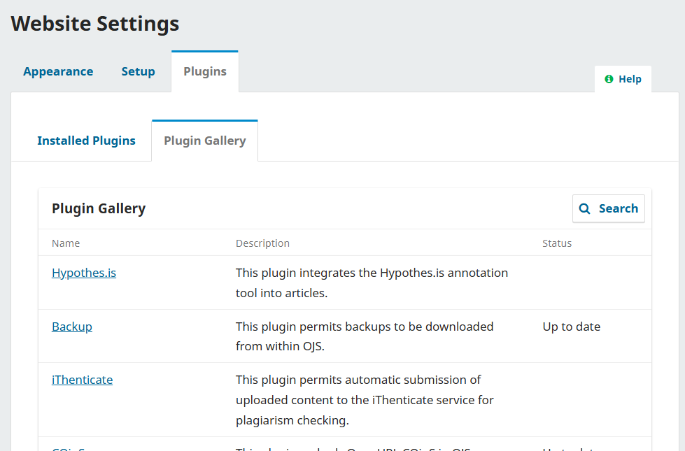
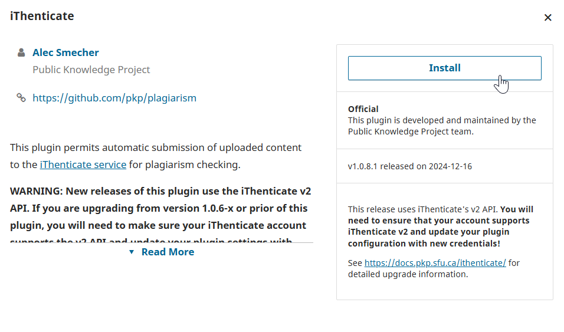
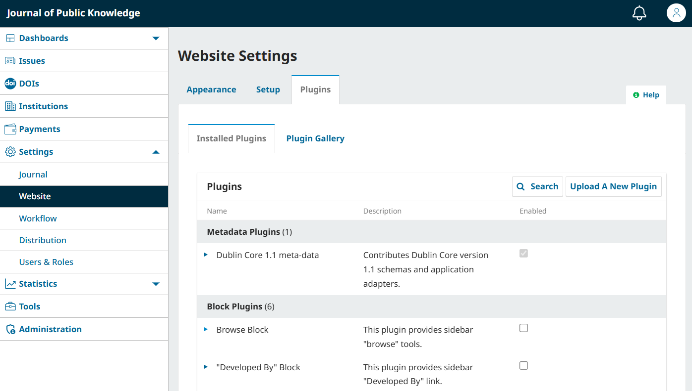
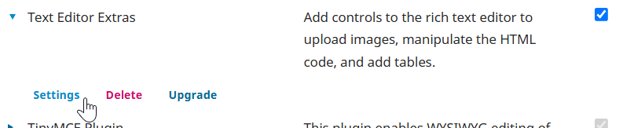

# OJS/OMP/OPS Plugin Guide and Inventory

## Introduction {#introduction}

A plugin is a software component that extends the base functionality of an existing software. Plugins can add fields to forms, change templates, save new information, modify authentication procedures, create new pages or change existing screens in the application, or add integration with external services.

This guide contains information on how to install and enable plugins, as well as a list with links to documentation for OJS/OMP/OPS. 

### Where to Find Plugins: The Plugin Gallery and External Plugins {#find-plugins}

OJS/OMP/OPS include a built-in Plugin Gallery with supported plugins created by PKP and third-party contributors. Many of these are not included by default, but can be installed by a Site Administrator and activated by any roles with access to OJS/OMP/OPS site settings.

In addition to those available in the Plugin Gallery, Site Administrators can also install custom or third-party external plugins available through other providers. If you are interested in developing your own plugins, please consult [Developer Documentation: Plugin Guide](https://docs.pkp.sfu.ca/dev/plugin-guide/en/) for details.

## Install, Enable, and Configure Plugins {#install}

In this section, you'll learn how to install, enable, and manage plugins in OJS/OMP/OPS. 

In the Plugins section of Settings: Website > Setup, you will find two tabs: Installed Plugins and Plugin Gallery. The Installed Plugins tab is where you can manage your current plugins, and the Plugin Gallery is where Site Administrators can add new plugins.

This PKP School video explains how to configure Plugins in OJS, but the process is the same for OMP and OPS. To watch other videos in this series, visit [PKP’s YouTube channel](https://www.youtube.com/playlist?list=PLg358gdRUrDVTXpuGXiMgETgnIouWoWaY).


### Add a Plugin from the Plugin Gallery

> Only Site Administrators are permitted to install new plugins. Please contact your Site Administrator to request installation.
{:.warning}

The "Plugin Gallery" tab shows all plugins that can be installed for your site, as well as information about whether plugins can be upgraded

To add a plugin, click the name of the plugin you wish to install. Read the information and click the Install button.

The plugin will now be available from the Installed Plugins tab. Newly installed plugins are **not** enabled by default and must be enabled in the Installed Plugins tab.

### Manage Installed Plugins

The "Installed Plugins" tab shows all plugins currently installed for your site. Site Administrators, Journal Managers, and Journal Editors with access to journal settings can freely enable, disable, and configure the plugins on this tab. The Plugin Gallery will only show plugins compatible with the version of the software you are using, and will refresh automatically to reflect changes to the [live plugin gallery list on GitHub](https://github.com/pkp/plugin-gallery/blob/main/plugins.xml).

To enable or disable a plugin, check or uncheck the box next to the plugin name. Note that some plugins are required for the system and cannot be disabled.

Use the Search button to locate a specific plugin from the list.

Plugins may have additional settings, or require configuration before they can be used. Click the blue arrow next to the plugin name to reveal additional options, including Settings, Delete, or Upgrade. 

**Settings**: Appears to Journal Managers, Journal Editors with access to settings, and Site Administrators. Access the custom settings menu for the plugin. These settings will differ with each plugin.
**Delete**: Only appears to Site Administrators. Remove the plugin from your site. The plugin can be reinstalled at any time from the Plugin Gallery.
**Upgrade**: Only appears to Site Administrators. Automatically installs the newest version of the plugin if it is not already installed.

### Install an External Plugin {#external-plugins}

Plugins found from sources outside of the Plugin Gallery will require manual installation. Only **Site Administrators** can upload these plugins. 

> **IMPORTANT:** Be sure to confirm that the plugin you are installing is compatible with the version of the software you are using by carefully reading the documentation provided by the developer. Installing a plugin that is not compatible with your OJS/OMP/OPS version can seriously impact software functionality.
{:.warning}

1. Download the plugin's tar.gz file from its repository under the Releases tab.
2. Go to the Installed Plugins tab of the journal.
3. At the top right, click ‘Upload a New Plugin’.
4. Upload the plugin file.
5. When it has finished uploading, click Save. It may take some time for the plugin to finish installing and become available in the Installed Plugins list.

> If your upload fails and you see an error message that reads "The uploaded plugin archive does not contain a folder that corresponds to the plugin name.”, this means you must simplify the name of the plugin folder inside the zipped file. Try renaming complex folder names such as “translator-ojs-3_0_0-0” to something simpler, such as “translator.”
{:.notice}

## Contribute a Plugin {#contribute}

If you have developed a plugin and wish to make it available to all OJS/OMP/OPS users, we recommend contributing it to the Plugin Gallery. Please view the [Plugin Gallery readme page](https://github.com/pkp/plugin-gallery) on our GitHub repository for details.

If your plugin is not available for the Plugin Gallery but you would like to have it included in the inventory below, [edit this page on GitHub](https://github.com/pkp/pkp-docs/tree/plugin-inventory/plugin-inventory) or send this information via [Documentation Feedback](https://pkp.sfu.ca/documentation-feedback/). Make sure the plugin is compatible with OJS/OMP/OPS 3.2+. Plugins not in the Gallery will be marked as “unvetted” on the list.

## Plugin Inventory {#inventory}

The inventory below contains plugins available in the Plugin Gallery for OJS/OMP/OPS and links to related documentation written by the plugin creator or PKP. The list is not exhaustive and will continue to be updated as more plugins and documentation becomes available. For compatibility details, see the [live plugin gallery list on GitHub](https://github.com/pkp/plugin-gallery/blob/main/plugins.xml), a list of compatible plugins for possible installation with version listing. 

### Acron

Attempts to reduce the dependance of the application on periodic scheduling tools such as 'cron.' Once enabled, this plugin should result in the processing of log files (along with other scheduled tasks, such as review and subscription reminders).

### Allowed Uploads

Enables journals to choose the filetypes that are allowed when submitting a manuscript.

* [Allowed plugin in GitHub](https://github.com/ajnyga/allowedUploads)

### Announcement Block

Displays the lastest announcement on the journals sidebar. Allows to specify how many announcements will be displayed.

* [Announcement Block Plugin in GitHub](https://github.com/RBoelter/announcementsBlock)

### Announcement Feed

Produces RSS/Atom web syndication feeds for journal announcements.

### Ark

Enables the assignation and management of ARK ID to issue, article and galley.

* [Ark Plugin in GitHub](https://github.com/yasielpv/pkp-ark-pubid)

### Articles Report

Generates a CSV spreadsheet containing a list of articles (published and unpublished), including the submission ID, title, abstract, author information, current status, and more.

* [Article Report guide](/learning-ojs/en/statistics#usage-statistics-report)

### Akismet

Verifies new user registrations via the Akismet anti-spam service. A subscription to Akismet is required for this plugin.

* [Akismet plugin in GitHub](https://github.com/ulsdevteam/pkp-akismet)

### Author Requirements

Allows certain author fields (e.g., email) to be made optional. This is useful in cases where required information does not exist for authors.

* [Author Requirement plugin in GitHub](https://github.com/ewhanson/authorRequirements)

### Authors History

Generates an additional tab within the manuscripts Publication tab and lists additional submissions in the system from each contributor.

* [Authors History plugin in GitHub](https://github.com/lepidus/authorsHistory)

### Backup

Allows site administrators to generate and download a full backup of the various components of their OJS 3.x/OMP/OPS installation.

* [Backup plugin in GitHub](https://github.com/asmecher/backup)

### Bepress Import (unvetted)

Facilitates the import from Bepress Digital Commons journals to OJS 3.1.1 or newer.

* [Bepress plugin in GitHub](https://github.com/mfelczak/bepress)
* [Migrating bepress Digital Commons Journals to OJS](https://pkp.sfu.ca/2017/12/07/migrating-bepress-digital-commons-journals-to-ojs/)

### Better Password

Provides additional password restriction options when users are selecting their own password.

* [Better Password plugin in GitHub](https://github.com/ulsdevteam/pkp-betterPassword)

### Bibi Epub Viewer

Embeds EPUb files on the article galley view for OJS and OMP using Bibi Epub Reader.

* [Bibi Epub Viewer plugin in GitHub](https://github.com/lepidus/epubViewer)

### Bootstrap3 Theme

Applies a starter Bootstrap 3 theme. Knowledge of HTML, CSS and JavaScript will be needed for this theme as it is designed to be a base and not a final product.

* [Bootstrap3 Theme guide](/pkp-theming-guide/en/theme-bootstrap3)
* [Bootstrap3 Theme in GitHub](https://github.com/pkp/bootstrap3)

### Browse By Section

Allows visitors to browse published articles by section in a journals sidebar or footer (depending on the theme).

* [Browse By Section plugin guide](/learning-ojs/en/settings-website#browse-plugin)
* [Browse By Section plugin in GitHub](https://github.com/pkp/browseBySection)

### Citation Style Language

Allow readers to get a published article's citation in one of several formats supported by the Citation Style Language.

* [Citation Style Language plugin guide](/learning-ojs/en/settings-website#citation-style-language-plugin)

### Clam Antivirus Plugin for OJS

Scans submission files using Clam Antivirus, blocking files with a known virus signature.

* [Clam Antivirus plugin in GitHub](https://github.com/ulsdevteam/pkp-clamav)

### Classic Theme

An official theme for OJS 3 that applies that plays on colour and font contrasts based on literary classicism.

* [Classic Theme plugin guide](/pkp-theming-guide/en/theme-classic)
* [Classic Theme plugin in GitHub](https://github.com/pkp/classic)

### COinS

Embeds OpenURL COinS in OJS articles permitting tools like Zotero to grab citations.

* [COinS plugin in GitHub](https://github.com/pkp/coins)

### Content Analysis

Checks the content of the submitted document for certain submission information and metadata for OPS

* [Content Analysis plugin in GitHub](https://github.com/lepidus/contentAnalysis)

### Control Public Files

Allows journal and press managers to limit who can upload public files and what kind of files they can upload. Provides settings to restrict who can upload, what kind of files they can upload, and how large their directory of files can grow.

* [Control Public Files plugin in GitHub](https://github.com/pkp/controlPublicFiles)

### COUNTER Reports

Generates a CSV spreadsheet of journal activity, using the COUNTER standard. These reports alone do not make a journal COUNTER compliant. To offer COUNTER compliance, review the requirements at the Project COUNTER website. As this report includes data from all journals hosted in this OJS instance, it is only available to Site Administrators.

* [COUNTER reports guide](/learning-ojs/en/statistics#usage-statistics-report)

### Crossref Reference Linking Plugin

Automatically adds the extracted article references to the DOI registration with Crossref. Crossref will then automatically check if any DOIs can be found for the submitted references. Shortly after that, using the scheduled task, the plugin will check for the found references DOIs. If article references change once they are registered, the article DOI with the new references will have to be registered anew. Then the check for the found references DOIs will be done again.
Requires Crossref DOIs to be assigned to articles, article references to be separately entered and extracted, as well as article DOIs to be deposited to Crossref from within OJS. It uses the Crossref Export/Registration plugin settings: Crossref credentials (username and password), as well as the setting for the testing mode.

* [Crossref Reference Linking Plugin guide](/crossref-ojs-manual/en/references)
* [Crossref Reference Linking Plugin in GitHub](https://github.com/pkp/crossrefReferenceLinking)

### CrossRef XML Export Plugin

Supports the automatic registration of DOIs with CrossRef and the export of XML metadata in Crossref format for manual DOI deposits.

* [CrossRef XML Export Plugin guide](/crossref-ojs-manual/en/)

### Custom Block Manager

Allows to add, edit and delete custom sidebar blocks.

* [Custom Block Manager guide](/learning-ojs/en/settings-website#custom-block-plugin)

### Custom Header Plugin

Permits the addition of custom headers to the website, including custom JavaScript.

* [Custom header plugin guide](/learning-ojs/en/settings-website#custom-header-plugin)
* [Custom header plugin in GitHub](/learning-ojs/en/settings-website#custom-header-plugin)

### Custom Locale

Allows customization of message keys (field names, labels, links, etc.) in locale files via the GUI. The default locales are replaced but not overwritten and can easily be restored.

* [Custom Local plugin guide](/translating-guide/en/customize-locale)
* [Custom Local Plugin in GitHub](https://github.com/pkp/customLocale/)

### Datacite export for OJS

Export or register issue, article, galley and supplementary file metadata in DataCite format.

* [Datacite export plugin guide](/admin-guide/en/data-import-and-export#datacite-exportregistration-plugin)
* [Datacite export plugin in GitHub](https://github.com/pkp/ojs/tree/main/plugins/generic/datacite)

### Datacite export for OMP

Registers DOIs for monographs and chapters for DOI provider Datacite.

* [Datacite export plugin in GitHub](https://github.com/withanage/datacite)

### DC Metadata Format

Structures metadata in a way that is consistent with the Dublin Core format.

### Default Theme

The default theme for OJS and OMP applies a simple, straightforward design. As of OJS/OMP/OPS 3.3, the Default Theme has been externally audited for accessibility and adheres to best practices like colour contrast, keyboard navigation, and form/link focus.

* [Default theme plugin guide](/pkp-theming-guide/en/theme-default)

### Default Translation

Make OJS fall back on English when elements of the software translation are missing.

* [Default translation plugin in Github](https://github.com/pkp/defaultTranslation)

### Developed By Block

Adds a link to [Open Journal Systems](https://pkp.sfu.ca/ojs/) in the sidebar.

### Disqus

Integrates with Disqus and allows users to add comments to the abstract pages.

* [Disqus plugin guide](/learning-ojs/en/settings-website#custom-header-plugin)

### DOAJ Export Plugin

Allows journals to manually or automatically deliver articles to the Directory of Open Access Journals (DOAJ) with a DOAJ API Key. Requires a journal to be DOAJ member - see [DOAJ application guide](/doaj/) for application instructions.

* [DOAJ Export plugin guide](/admin-guide/en/data-import-and-export#doaj-export-plugin)

### DOI

Enables the assignment of the Digital Object Identifiers to issues, articles and galleys in OJS. Can work in pair with Crossref, Datacite or Medra plugins for automatic content registration.

* [DOI plugin guide](/doi-plugin/en/)

### DOI to mEDRA xml export and registration

Enables the export of issue, article and galley metadata in ONIX4DOI format and the registration of DOIs with mEDRA.

* [mEDRA plugin guide](/admin-guide/en/data-import-and-export#medra-exportregistration-plugin)
* [mEDRA plugin in GitHub](https://github.com/pkp/medra/)

### DRIVER

Extends the OAI-PMH interface according to the DRIVER Guidelines 2.0, helping OJS journals to become DRIVER compliant.

### Dublin Core Indexing

Embeds Dublin Core meta tags in article views for indexing purposes.

### Email Issue Table of Contents

Embeds the table of contents within the default notification email sent when publishing an issue.

* [Email Issues TOC plugin in GitHub](https://github.com/ulsdevteam/pkp-emailIssueToc)

### EPUB viewer

Embeds EPUB files on the article galley view pages using epub.js.

* [EPUB viewer plugin in GitHub](https://github.com/EKT/epubJsViewer-ojs)

### Forthcoming articles (unvetted)

Allows journals to preview single articles on their website before an entire issue is published.Hides the Forthcoming issue from the regular issue archive and redirect all traffic from the issue table of contents page to the custom Forthcoming listing page.

* [Forthcoming articles plugin in GitHub](https://github.com/ajnyga/forthcoming)

### Funding

Adds submission funding data using the Crossref funders registry, considers the data in the Crossref and DataCite XML export and displays them on the submission view page.

* [Funding plugin in GitHub](https://github.com/ajnyga/funding/)

### Google Analytics

Integrates OJS with Google Analytics, Google's web site traffic analysis application. Requires that you have already setup a Google Analytics account. See Google Analytics site for more information.

### Google Scholar Indexing

Enables indexing of published content in Google Scholar.

* [Google Scholar plugin guide](/google-scholar/en/)

### Health Sciences Theme

An official theme for OJS 3 that applies designed to maximize legibility and content clarity, built with a focus on health sciences journals.

* [Health Science Theme plugin guide](/pkp-theming-guide/en/theme-healthsciences)
* [Health Science Theme plugin in GitHub](https://github.com/pkp/healthSciences)

### Honeypot

Verifies new user registrations by creating a honeypot on the User Registration form. This plugin operates at the site level and requires Site Administrator privileges to configure.

* [Honeypot plugin in GitHub](https://github.com/ulsdevteam/pkp-formHoneypot)

### HTML Article Galley

Provides browser-based HTML Viewer for HTML Article Galleys (OJS).

### HTML Monograph File

Provides browser-based HTML Viewer for monogrpah files (OMP).

### Hypothes.is

Adds Hypothes.is integration to the public article view, permitting annotation and commenting. It currently supports commenting on HTML galleys; see README for instructions on extending the functionality to PDF galleys.

* [Hypothes.is plugin guide](/learning-ojs/en/settings-website#hypothesis-plugin)
* [Hypothes.is plugin in GitHub](https://github.com/asmecher/hypothesis)

### Immersion Theme

An official theme for OJS 3 that emphasizes the reading experience and offers bold design options such as a full-width header image and per-section color choices.

* [Immersion Theme plugin guide](/pkp-theming-guide/en/theme-immersion)
* [Immersion Theme plugin in GitHub](https://github.com/pkp/immersion)

### Information Block

Provides sidebar information block with 3 sections: For Readers, For Authors, For Librarians. Standard text for these sections can be edited in Website > Setup > Information

### Inline Html Galley

Provides inline display of article galleys for OJS, replacing the default HTML Article Galley plugin's use of an iframe to deliver the HTML Galleys.

* [Inline Html Galley plugin in GitHub](https://github.com/ulsdevteam/inlineHtmlGalley)

### iThenticate

Permits automatic submission of all uploaded files to the iThenticate service for plagiarism checking. This plugin will require an iThenticate account to be set up.

* [iThenticate plugin in GitHub](https://github.com/asmecher/plagiarism)

### JATS Template

Permits OJS to use a basic JATS XML document generated from the OJS metadata and full-text extraction in cases where a better JATS XML document is not available. It is intended to be used in concert with the OAI JATS plugin to deliver JATS via OAI for journals that do not have better JATS XML available.

* [JATS Template plugin in GitHub](https://github.com/pkp/jatsTemplate/)

### Keyword Cloud Plugin

Provide a tag cloud of article keywords that can be added to a journals sidebar.

* [Keyword plugin guide](/learning-ojs/en/settings-website#keyword-cloud-plugin)
* [Keyword plugin in GitHub](https://github.com/lepidus/ojs3-keywordcloud-plugin)

### Language Toggle Block

Provides the sidebar language toggler. More than one language needs to be enabled for it to work, in Website > Setup > Languages

### Lens Viewer for Monographs and Journal Articles

Provides browser-based HTML Viewer for Journal Articles and Monographs based on JATS-standard XML files.

* [Lens Viewer plugin in GitHub](https://github.com/withanage/lensGalleyBits)

### Lucene/Solr Plugin

Integrates the solr/search for OJS journals. Integration requires additional configuration and it is recommended to test on a test installation, before using on a production server.

* [Lucene/Solr plugin in GitHub](https://github.com/ojsde/lucene)

### Make a Submission Block

Provides a sidebar block with a "Make a Submission" link.

### Manual Fee Payment

Allows the manager to manually record receipt of a user's payment (outside of this software).

* [Manual Fee Payment plugin guide](/learning-ojs/en/subscriptions#payments)

### Manuscript (Default child theme)

Applies a clean, simple theme with a boxed layout that mimics a paper document.

* [Manuscript theme plugin guide](/pkp-theming-guide/en/theme-manuscript)
* [Manuscript theme plugin in GitHub](https://github.com/pkp/defaultManuscript)

### MARC Metadata Format

Structures metadata in a way that is consistent with the MARC format.

### MARC21 Metadata Format

Structures metadata in a way that is consistent with the MARC21 format.

### Material Theme

Applies Material Theme (MDBootstrap based) theme for the reader frontend.

* [Material Theme plugin in GitHub](https://github.com/madi-nuralin/material)

### Matomo

Permits usage statistics tracking using Matomo (formerly Piwik).

* [Matomo plugin in GitHub](https://github.com/pkp/piwik)

### Most read

Creates a “most read articles” section in the journal’s sidebar with the 5 most viewed articles (with links) in the last week, along with the number of views per article.

* [Most read plugin guide](/learning-ojs/en/settings-website#most-read-plugin)

### Native XML

Allows import and export of articles and issues in OJS's native XML format between the same OJS versions.

* [Native XML plugin guide](/admin-guide/en/data-import-and-export#native-xml-plugin)

### OAI JATS

Exposes JATS XML via the OAI-PMH interface. Note that it DOES NOT generate JATS XML itself -- it assumes that this will already be available.

* [OAI JATS plugin in GitHub](https://github.com/pkp/oaiJats/)

### ONIX 3.0 Monograph Export Plugin

Exports monograph metadata in the ONIX 3.0 format for OMP.

### Open Graph

Open Graph Plugin presents published content using the Open Graph protocol. Open Graph tags are used when you content is shared in Facebook.

* [Open Graph plugin in GitHub](https://github.com/ajnyga/openGraph)

### OpenAIRE

Adds the ProjectID element to the article metadata and extends the OAI-PMH interface according to the OpenAIRE Guidelines 1.1, helping OJS journals to become OpenAIRE compliant.

* [OpenAIRE plugin in GitHub](https://github.com/ojsde/openAIRE)

### OpenID Authentication

Enables users to log in to PKP applications using OpenID Connect providers. It currently supports Google, Apple ID, Microsoft Azure AD and Orchid. It is also possible to configure a custom OpenID Connect provider such as Keycloak.

* [Open ID Authentication plugin in GitHub](https://github.com/leibniz-psychology/openid)

### ORCID Profile

Allows users to automatically import user profile data from the ORCID profile into OJS with their ORCID ID.

* [ORCID Profile plugin guide](/orcid/en/)
* [ORCID Profile plugin in GitHub](https://github.com/pkp/orcidProfile)

### Paperbuzz

Displays free altmetrics (an alternative to traditional citation-based metrics) based on open Crossref Event data. To use this plugin, your journal must have DOIs assigned to articles and properly deposited with Crossref.

* [Paperbuzz plugin in GitHub](https://github.com/pkp/paperbuzz)

### PayPal Fee Payment

Supports the processing of payments the PayPal service. Payment types include author processing charges (single fee), reader fees (articles and issues), general fees.

* [PayPal plugin guide](/using-paypal-for-ojs-and-ocs/en/)
* [PayPal instructions in Payments](/learning-ojs/en/subscriptions#payments)

### PDF.JS PDF Viewer

Provides browser-based viewer for article and issue galleys in PDF.

### PKP Usage Statistics Report

Generates a CSV spreadsheet containing monthly views for the journal homepage; issue TOCs; article abstract/landing pages; and file downloads. It can provides country information (if configured).

* [Usage Statistics Report plugin guide](/learning-ojs/en/statistics#usage-statistics-report)

### PKP PN

Enables the automatic preservation of published journal content in the [PKP Preservation Network](https://pkp.sfu.ca/pkp-pn/). This plugin requires [ZipArchive](https://www.php.net/manual/en/zip.installation.php) support.

* [PKP PN plugin guide](/pkp-pn/en/)
* [PKP PN plugin in GitHub](https://github.com/pkp/pln)

### Plaudit

Adds the Plaudit widget to the submission details on the submission's landing page; integration token required.

* [Plaudit plugin in GitHub](https://github.com/lepidus/plaudit)

### Plugins update notification

Generates a notification in the Website Settings  informing which plugins have an upgrade available at the plugin gallery.

* [Plugin update notification plugin in GitHub](https://github.com/lepidus/pluginUpdateNotification)

### Plum Analytics

Provides display of PlumX Metrics from Plum Analytics on the article level for PKP Open Journal Systems.

* [Plum Analytics plugin in GitHub](https://github.com/ulsdevteam/ojs-plum-plugin)

### Portico

Provides an import/export plugin to generate metadata information for articles and issues for indexing in Portico FTP deposit. Details on the XML format and data requirements is available at: [https://www.portico.org](https://www.portico.org). This plugin requires [ZipArchive](https://www.php.net/manual/en/zip.installation.php) support.

* [Portico plugin in GitHub](https://github.com/pkp/portico)

### Pragma Theme

An official theme for OJS 3 that applies a minimalist OJS theme inspired by early periodicals’ tables of contents featuring a bold use of a monochromatic colour palette.

* [Pragma Theme plugin in GitHub](https://github.com/pkp/pragma)

### Public Identifier Resolver

Resolves individual articles, issues and galleys in the current OJS installation using the supplied public identifier register in OJS. It can obtain the element metadata using the format ERC adding question marks at the end of the persistent identifier. ERC format includes the metadata who, what, when, where, how and target.

* [Public Identifier Resolver plugin](https://github.com/yasielpv/pubIdResolver)

### Publons Reviewer Recognition

Enables integration with Publons Reviewer Recognition Service. This plugin will require the [Reviewer Recognition Service](https://publons.com/benefits/publishers) to account to be set up.

* [Publons Reviewer Recognition plugin in GitHub](https://github.com/publons/ojs_3_plugin/)

### PubMed XML Export

Export article metadata in PubMed XML format for journals indexed in MEDLINE.

* [PubMed XML Export plugin guide](/admin-guide/en/data-import-and-export#pubmed-xml-export-plugin)

### PURL

Enables the assignation and management of persistent uniform resource locator (PURL) ID to issue, article and galley.

* [PURL plugin in GitHub](https://github.com/yasielpv/pkp-purl-pubid)

### QuickSubmit

Permits Journal Managers/Editors to quickly enter submissions through the OJS website, bypassing the editorial workflow.

* [QuickSubmit plugin guide](/learning-ojs/en/tools#quick-submit-plugin)
* [QuickSubmit plugin in GitHub](https://github.com/pkp/quickSubmit)

### Recommend Articles by Author

Inserts a list of articles by the same author on the article abstract/landing page.

* [Recommended Articles plugin guide](/learning-ojs/en/settings-website#recommend-articles-by-author-plugin)

### Recommend Similar Articles

Adds a list of similar articles to the bottom of the articles abstract/landing page.

* [Recommended Similar Articles plugin guide](/learning-ojs/en/settings-website#recommend-similar-articles-plugin)

### Registration Notification

Sends an email notification to a configurable list of emails, configurable per journal/press, whenever a new user is registered. The email content is configurable through the email template named Registration Notification. The following variables are provided by the plugin: $date, $userFullName, $userName, $userEmail

* [Registration Notification plugin in GitHub](https://github.com/pkp/registrationNotification)

### Research Organization Registry(ROR)

Integrates support for [ROR](https://ror.org/). Organizations maintained by ROR.org are automatically fetched using an auto suggesting function. For multilingual journals, additionally supported languages will be pre-filled given, ROR.org has the corresponding names in the OJS supported languages.

* [ROR plugin in GitHub](https://github.com/withanage/ror/)

### Returning Author Screening

Permits authors using who already have at least one published submission to self-publish subsequent submissions on OPS.

* [Returning Author Screening plugin in GitHub](https://github.com/pkp/returningAuthorScreening)

### ReviewerCredits

Enables integration with ReviewerCredits. ReviewerCredits Journal credentials will be required to configure the plugin.

* [ReviewerCredits plugin in GitHub](https://gitlab.com/reviewercredits/reviewercredits-ojs-plugin)

### Review Report

Generates a CSV report containing a list of review assignments for a journal, including reviewer names, reviews, and recommendations.

* [Review Report guide](/learning-ojs/en/statistics#usage-statistics-report)

### RFC1807 Metadata Format

Structures metadata in a way that is consistent with the RFC1807 format.

### SciELO Submissions Report

Generates a CSV spreadsheet with submissions information for OJS and OPS that is usually requested by SciELO.

* [SciELO Submissions Report plugin in GitHub](https://github.com/lepidus/scieloSubmissionsReport)

### Scopus/Crossref Citations

Uses an articles DOI to get all citations from Scopus and/or Crossref. Google Scholar and PubMed are also supported. The count and list of citations is displayed in the sidebar of the article details. It is possible to choose between the different providers and display only the amount of results if the list is not desired.

* [Scopus/Crossref Citations plugin guide](/crossref-ojs-manual/en/citationsplugin)
* [Scopus/Crossref Citations plugin in GitHub](https://github.com/RBoelter/citations)

### Shariff

Adds social media buttons to your web site (to the footer of each page or the sidebar) without compromising the privacy of website users.

* [Shariff Plugin in GitHub](https://github.com/ojsde/shariff)

### Shibboleth

Adds an ability to use shibboleth single sign-on service to register and authenticate users. You must have set up and configured the local service provider (SP).

* [Shibboleth plugin guide](/admin-guide/en/single-signon#setting-up-shibboleth)
* [Shibboleth plugin in GitHub](https://github.com/pkp/shibboleth)

### Sitesearch

Allows searches done in one journal (within a multi-journal installation) to be performed at the site level and returns results from all journals.

* [Sitesearch plugin in GitHub](https://github.com/ulsdevteam/pkp-sitesearch)

### Subscription Block

Provides sidebar subscription information in journals with enabled subscriptions.

* [Subscription Block plugin guide](/learning-ojs/en/subscriptions#subscription-block)

### Subscription SSO

Permits delegation of OJS subscription checks to a third-party web service.

* [Subscription SSO plugin in GitHub](https://github.com/asmecher/subscriptionSSO)

### Subscriptions Report

Generates a CSV spreadsheet containing a list of subscriptions and their information. This report provides subscription status, type, format, dates, and subscriber information.

* [Subscription Report plugin guide](/learning-ojs/en/statistics#usage-statistics-report)

### Suggested Reviewers Plugin by Ubiquity Press (unvetted)

Allows journals to enable Recommended and Excluded Reviewers into the Author Submission form. This information will be displayed on top of the reviewer list when Editors select reviewers for a manuscript.

* [Suggested Reviewers Plugin in Gitlab](https://gitlab.com/ubiquitypress/ojs-plugin-suggested-reviewers)

### SushiLite

Provides the NISO SUSHI-Lite standard (2015 draft release) for PKP software.

* [SushiLite plugin in GitHub](https://github.com/ulsdevteam/ojs-sushiLite-plugin)

### SWORD Deposit

Permits the use of the SWORD protocol to deposit documents from OJS into other systems.

* [Sword plugin in GitHub](https://github.com/asmecher/sword/)

### Sword Server

Permits the use of the [SWORDv2 protocol](http://swordapp.org/sword-v2/) to allow OJS to receive deposit documents from other systems.

* [Sword Server plugin in GitHub](https://github.com/quoideneuf/swordServer)

### Text Editor Extras

Provides additional rich text editor control (upload images, manipulate the HTML code, and add tables) to various text fields.

* [Text Editors Extras plugin in GitHub](https://github.com/pkp/textEditorExtras)

### Texture

Integrates the Texture JATS XML editor with OJS.

* [Texture plugin in GitHub](https://github.com/pkp/texture)

### TinyMCE

Converts select textareas to WYSIWYG XHTML editors using the TinyMCE cross-browser Javascript editor. This allows authors, editors, etc. to easily enter valid HTML into the various forms for more control over the appearance of their content.

### Title Page (unvetted)

OPS plugin that creates a title page on PDF files submitted to preprint servers. The title page is a page added to the beginning of the PDF file, containing a series of information about the preprint when it is posted. After the preprint is posted, the title page is also updated if the preprint relations are changed.

* [Title Page Plugin in GitHub](https://github.com/lepidus/titlePageForPreprint)

### Toggle Required Metadata

Allows to make the "affiliation" and "ORCID" fields required for contributors on a submission.

* [Toggle Required Metadata Plugin in GitHub](https://github.com/lepidus/toggleRequiredMetadata)

### Twitter Block

Integrates Twitter feeds in a multi-journal instance without the need to create several custom blocks. This plugin requires Administrator access to configure and enable/disable.

### URN

Enables the assignment of the Uniform Resource Names to the issues, articles and galleys.

### Usage event

Creates a hook that provides usage event in a defined format.

### Usage Statistics

Displays the number of article downloads on the article page, in bar or line graph format. Requires Administrator access to be enabled or disabled.

* [Usage Statistics plugin guide](/learning-ojs/en/settings-website#usage-statistics-plugin)

### Users XML

Allows import and export of users and their roles between the same OJS versions.

* [Users XML plugin guide](/admin-guide/en/data-import-and-export#export-users-to-xml)

### View Report

Generates a CSV spreadsheet describing readership for each article, including article title, issue, date published, and view counts (for abstracts, individual galleys, total galleys).

* [View Report in guide](/learning-ojs/en/statistics#view-report)

### Web Feed Plugin

Produces RSS/Atom web syndication feeds for the current issue.
