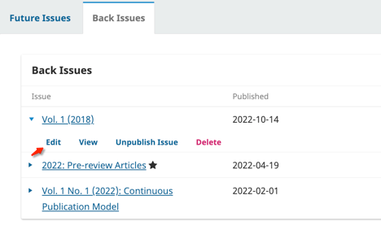
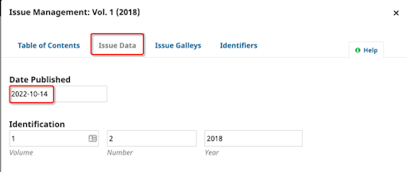

# Issue Creation Publication

## Create the Issue
1. Go to Issues
2. Click on the Future Issues tab
3. Click on Create Issue
4. Enter the relevant issue fields
5. Upload the full issue galley (optional)
6. Click Save to create the Issue

## Publish the Issue Immediately
You will begin by publishing the newly created issue. 
1. Click the arrow to expand the issue menus.
2. Click "publish issue."

Once the Issue has been published, it will move to the Back Issues tab. 

## Edit Publication Metadata for Now-Published Issue
1. Click on the "back issues" tab.
2. Click the arrow next to the back issue to expand the issue menus.
3. Click on "edit."

4. Change the publication date at the very top to the original publication date of the issue. The publication date is only available after the Issue has been published.

5. Click "save”.
