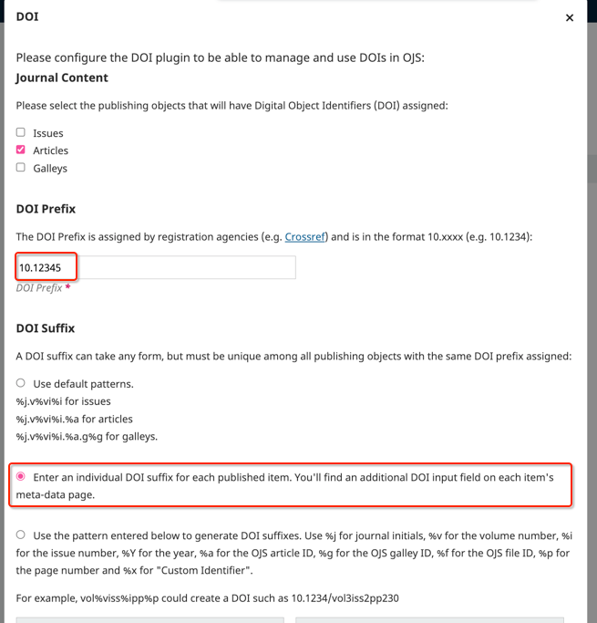
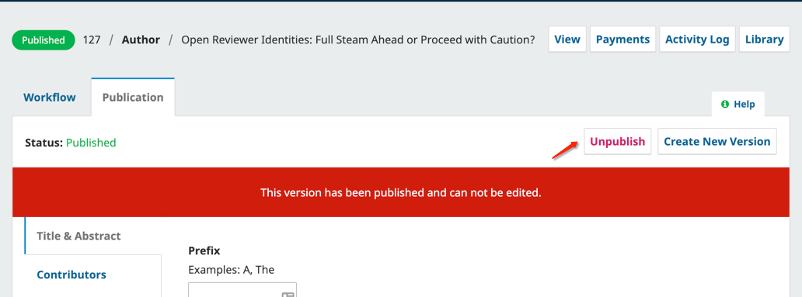
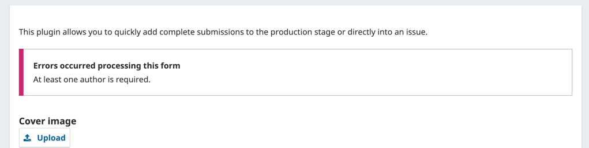
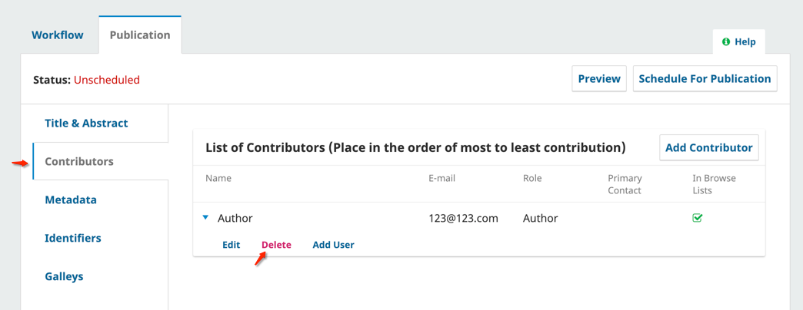
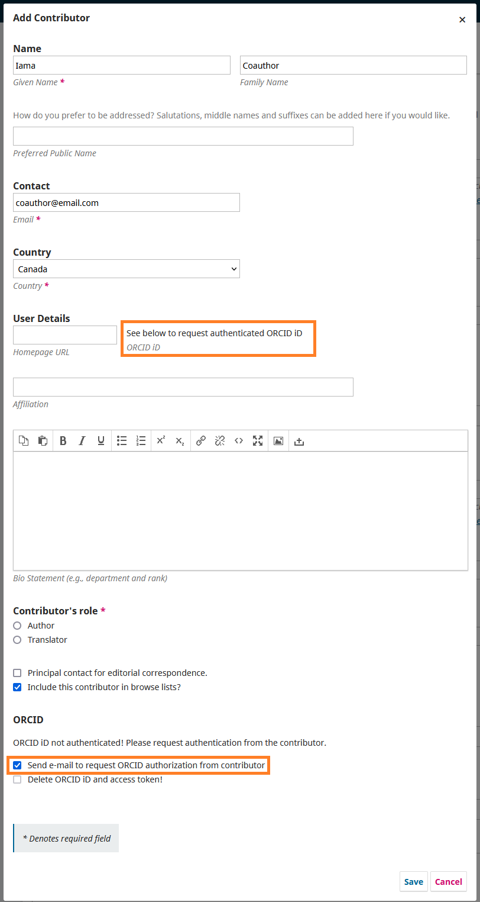

# Introduction
The QuickSubmit plugin is a tool for OJS that can be used to add content directly into issues without going through the individual steps of the editorial workflow (peer review, copyediting, production, etc.) This is useful for uploading previously published issues (back issues) into OJS for journals and publications that are migrating to the platform. 

This guide provides instructions on uploading “back issue” content with the original publication dates using the QuickSubmit plugin available in OJS, as well as instructions for importing existing DOIs, including ORCiDs, or bypassing certain fields such as email and abstracts.

# Step One: Create and Publish an Issue

Firstly, you will want to create and publish an issue in OJS for each back issue. These steps are the same as creating and publishing an issue for new content, which you can review in the [Create Issues section of the Learning OJS Guide](https://docs.pkp.sfu.ca/learning-ojs/3.3/en/production-publication#create-issue). Repeat this process for all previously published volumes/numbers you are planning to upload to OJS. Even if the issues are empty, publishing the issue veforehand will allow you to adjust the publication dates or other values in the next steps.

# Step Two: Edit Publication Date for Back Issues

Typically, OJS sets the publication date as the date when the "Publish Issue" button was pressed. For back issues, you will likely want to edit this publication date to properly reflect the date when the issue was originally published. 

1. Click on the "Back Issues" tab to locate the issue(s) you've just created to contain the articles you will upload for your back issue(s).
2. Click the arrow next to the issue to expand the menu.
3. Click "Edit".
4. Change the publication date at the very top to the original publication date of the issue. The publication date is only available after the issue has been published.
5. Click "Save". You can now unpublish and republish the issue at any time if needed without affecting the newly entered publication date.

# Step Three: Add Articles Using QuickSubmit
You can now use the QuickSubmit plugin to add articles to the back issues you've created with the original publication date. Please reference our [detailed instructions for the QuickSubmit plugin in Learning OJS](https://docs.pkp.sfu.ca/learning-ojs/en/tools#quick-submit-plugin) as needed (a video tutorial is also available at the link).

If you are uploading articles with existing DOIs or articles without contributors, without contributor emails, or without abstracts, further instructions are provided below.

## Uploading Back Issue Articles with existing DOIs

If the back issue content was previously published with a DOI, you should reassign the same DOI rather than assigning the same content a new DOI. The QuickSubmit form does not allow you to enter DOIs - you will need to manually enter them for each article later. Complete the QuickSubmit submission as outlined in the previous section, then follow these steps:

### Temporarily configure the DOI plugin for back issues

If you are not already using the DOI plugin, you will need to configure it now. Go to Website > Plugins and use the Search to locate the DOI plugin. Enter your prefix and select the second option for the DOI Suffix pattern ("Enter an individual DOI suffix for each published item"). If you need more information on how to configure this plugin, (consult our DOI plugin guide for step-by-step instructions)[https://docs.pkp.sfu.ca/doi-plugin/en/doi-plugin#configuring].

> *If you are already using the plugin and the back issue content was published with a different DOI Prefix*, you will need to *temporarily* enter the previous prefix in the DOI plugin while you are adding your back issue content using QuickSubmit and enable the "Enter an individual DOI suffix for each published item. You'll find an additional DOI input field on each item's meta-data page." setting. **Please remember to restore your DOI settings to the necessary prefix for ongoing publication and/or reenable automatically generated suffix patterns when you are done with your back issues or switching to publishing new content.** 
{:.warning}

### Insert existing DOI for each article

Navigate to the submission dashboard by clicking on “'Go to Submission”' when you complete a QuickSubmit, or navigate there using the editorial dashboard/issues dashboard. For each article that needs an existing DOI added, you will need to view the submission and complete the following steps.

1. Click the "Publication" tab.
2. Click the "Unpublish" button if the article is currently published.

4. Click the "Identifiers" tab, insert the existing DOI in the provided field, and click "Save".
5. Click "Schedule For Publication" to republish the article.

### Update the DOI registration

Finally, you will need to update the DOI registration record so that the DOI is pointing to the new OJS version. Navigate to the appropriate DOI registration plugin (e.g. CrossRef) to update the DOI metadata by depositing the article to the registration service. You can (read more about configuring DOI registration plugins and updating DOI records from our CrossRef manual)[https://docs.pkp.sfu.ca/crossref-ojs-manual/en/config].

## Uploading Back Issue Articles with no Contributors

>  **Articles without at least one contributor author will cause validation errors if you intend to distribute the metadata further** (e.g. to register a DOI or get the article indexed in most databases). For example, the Crossref plugin expects at least one contributor surname. Blank contributors may also cause deposit problems for the PKP Preservation Network.
{:.warning}

The QuickSubmit plugin requires that at least one Contributor be input in order to upload an article. 

If an article was original published without any author/contributor listed, you will need to enter a placeholder author in order to save the form. After the article has been successfully created, use the "Go to Submission" link to access the submission.

Temporarily unpublish the Article using the "Unpublish" link in the upper right.

Go to the "Contributors" Tab and delete the placeholder author.

Once completed, click "Schedule For Publication" to republish the Article.

## Uploading Back Issue Articles without Contributor Emails

OJS and QuickSubmit generally require an email to be associated with each contributor. If you will be uploading articles where a Contributor does not have an email address (or articles published from a time period before email addresses), you can install and enable the “Author Requirements Plugin” available in the Plugin Gallery. Detailed information on installing, enabling, and configuring plugins can be found in the (Plugins section of Learning OJS)[https://docs.pkp.sfu.ca/learning-ojs/en/settings-website#plugins]. 

When this plugin is enabled, access the plugin's settings menu to enable the option that makes Author emails optional. This option and/or plugin can be disabled at a later date if you would like future submissions to the journal to require an email.

## Uploading Back Issue Articles without Abstracts

If you wish to upload articles that do not have an abstract, ensure that the Section selected for the articles has been configured so that it does not require abstract in Journals > Sections. You can read more about configuring sections in the [Sections portion of Learning OJS](https://docs.pkp.sfu.ca/learning-ojs/3.3/en/journal-setup#sections).

## Uploading Back Issue Articles with ORCIDs

ORCIDs can be added to articles added through QuickSubmit one of two ways depending on whether your journal uses the ORCID plugin.

### If the ORCID Plugin is Enabled

If you already use the [ORCID plugin](https://docs.pkp.sfu.ca/orcid/en/), you should [invite authors to provide ORCID authorization to connect their ORCID iDs to the publication](https://docs.pkp.sfu.ca/orcid/en/using-plugin#editors-can-invite-contributors-to-connect-their-orcid-ids-to-the-publication). The invitations can be sent when you are filling out the Contributor information. 

### If the ORCID Plugin is Not Enabled

If you are not using the ORCID plugin, but still want to include the ORCID iD in the article information, you can insert it manually.  Be careful to copy and paste the ORCID directly from the ORCID iD profile to avoid typos. And ensure that you use https (not http), in order to avoid future validation errors. 

