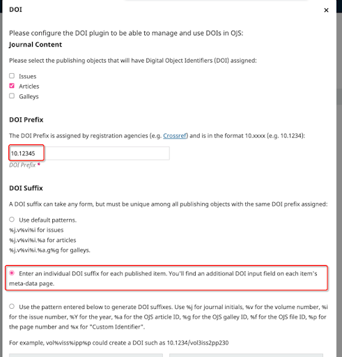
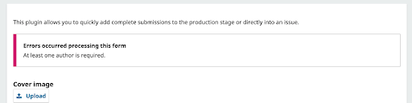
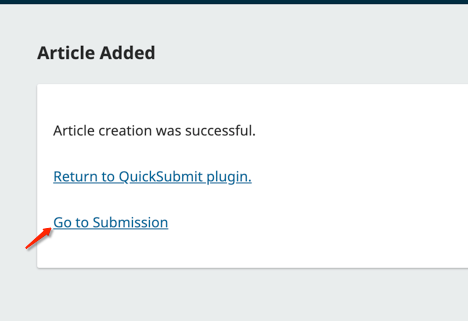
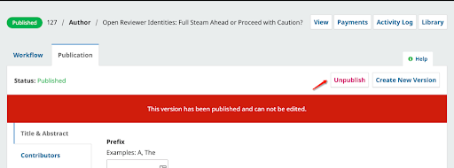
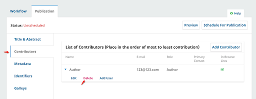
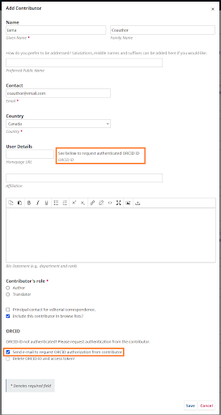
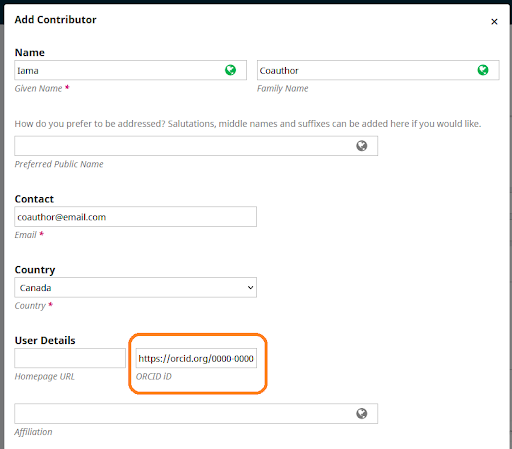

# Special Cases

## Uploading Back Issue Articles with existing DOIs

If the back issue content was published with a DOI already, you should reassign the same DOI rather than assigning the same content a new DOI.  The QuickSubmit form does not allow you to enter any DOIs. To re-use existing DOIs, you will need to be manually entered for each article. Complete the QuickSubmit submission as outlined in the previous section, then follow these steps:

**Configure the DOI plugin (one-time setup)**: To allow for this, you must configure the DOI plugin for manually entered individual DOIs.

Go to Website > Plugins > Search for the DOI plugin. Enter your prefix and select the second option for the DOI Suffix pattern. If the back issue content was published with a different DOI Prefix, you will need to enter the previous prefix in the DOI plugin while you work on QuickSubmits. 

**Please note** : if you are using the DOI plugin to assign DOIs for future content automatically, you may need to toggle these settings back and forth.

**Insert existing DOI for each article:** Navigate to submission dashboard by clicking on “'Go to Submission”' when you complete a QuickSubmit, or navigate there using the editorial dashboard/issues dashboard. 
- Click the “'Publication”' tab. 
- If you’ve already published it, you will need to “'Unpublish”' the article to add the DOI, so click “'Unpublished”'
- Click the Identifiers tab. Copy & paste in the existing Assign DOI, then click Save (we strongly advise against typing it in manually, to prevent typos).
- Click “'Schedule For Publication”' to republish the article.

**Update the DOI registration:** Finally, you need to update the DOI registration record so that the DOI is pointing to the new OJS version. Navigate to the appropriate DOI registration plugin (see [CrossRef guide](https://docs.pkp.sfu.ca/crossref-ojs-manual/en/config)) to update the DOI metadata.

## Uploading Back Issue articles without Contributor
**Note:** Please note articles without at least one contributor author will cause validation errors if you intend to distribute the metadata further (e.g. to register a DOI or get the article indexed in most databases). For example, the Crossref plugin expects at least one contributor surname. Blank contributors may also cause deposit problems for the PKP Preservation Network.

The QuickSubmit plugin will require that at least one Contributor be inputted to save the form.

If an article has been published without a Contributor, you will need to input a placeholder author in order to save the form. Once the Article has been added, you can go to the Submission.

Unpublish the Article 

Go to the Contributors Tab and delete the placeholder author.

Once completed, click Schedule For Publication to republish the Article.

## Uploading Back Issue articles without Contributor Emails

If you will be uploading articles where a Contributor does not have an email address. 
You can install and enable the “Author Requirements Plugin” available in the Plugin Gallery. There is an option to make emails optional, which works on the QuickSubmit plugin. 

## Uploading Back Issue articles without Abstract
If you are uploading articles that do not have an abstract, make sure that the Section the article belongs to has been configured so that it does not require abstracts. To adjust Section configurations, go to Journals > Sections. 

## ORCID
ORCIDs are optional but can be a very useful part of the contributor information.

If you already use the [ORCID plugin](https://docs.pkp.sfu.ca/orcid/en/) (recommended option), you should [invite authors to provide ORCID authorization to connect their ORCID iDs to the publication](https://docs.pkp.sfu.ca/orcid/en/using-plugin#editors-can-invite-contributors-to-connect-their-orcid-ids-to-the-publication).  The invitations can be sent when you are filling out the Contributor information. 

If you are not using the ORCID plugin, but still want to include the ORCID iD in the article information, you can insert it manually.  Be careful to copy and paste the ORCID directly from the ORCID iD profile to avoid typos. And ensure that you use https (not http), in order to avoid future validation errors.

