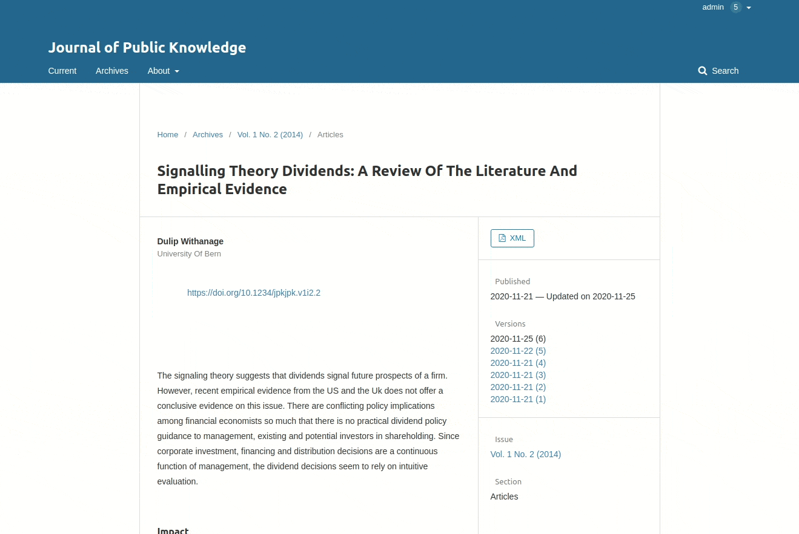

# About the ROR Plugin

The ROR Plugin for OJS and OPS 3 enables authors to find and add the organization they are affiliated with from the list of organizations maintained by the [Research Organization Registry (ROR)](https://ror.org). When an author begins to type in their organization, organizations from ROR will be automatically fetched and suggested. This is particularly helpful for multilingual journals, since an author can type in their organization name in any language they prefer and ROR will offer the corresponding organization, since its records include the organization name in different languages as well as organization name variants and acronyms. 

The ROR Plugin is shipped with the OJS Plugin gallery for OJS 3.2. For installation of the ROR plugin in OJS 3.2, see [Installing the ROR Plugin](#Installing-the-ROR-plugin). The ROR ID is automatically integrated into OJS beginning with OJS 3.3 and therefore does not need to be installed.

The ROR plugin can be used with OJS 3.x and OPS 3.x. It is not compatible with OMP.



## Installing the ROR Plugin

 1. Login as admin or Journal manager
 1. Select _Settings -> Website -> Plugins_
 1. Click On _Plugin Gallery_
 1. Select and click on _Research Organization Registry (ROR) Plugin_
 1. Click _Install_ in the opened modal and wait for the _installation_ to finish.
 1.  Click on _Enable_ button . ROR Plugin is installed under generic plugins.

**This step is _`only`_ required if you are using a version of OJS 3.2 prior to `30.11.2020` or if you are _`not`_ using `default theme`**.

 *  Locate the file `templates/frontend/objects/article_details.tpl`
 *   Find the following code in the template
 ```xml
<span class="affiliation">
    {$author->getLocalizedData('affiliation')|escape}
</span>
```
*  Add the ROR Icon template variable
```xml
<span class="affiliation">
    {$author->getLocalizedData('affiliation')|escape}
    {if $author->getData('rorId')}
        <a href="{$author->getData('rorId')|escape}">{$rorIdIcon}</a>
    {/if}
</span>
```


