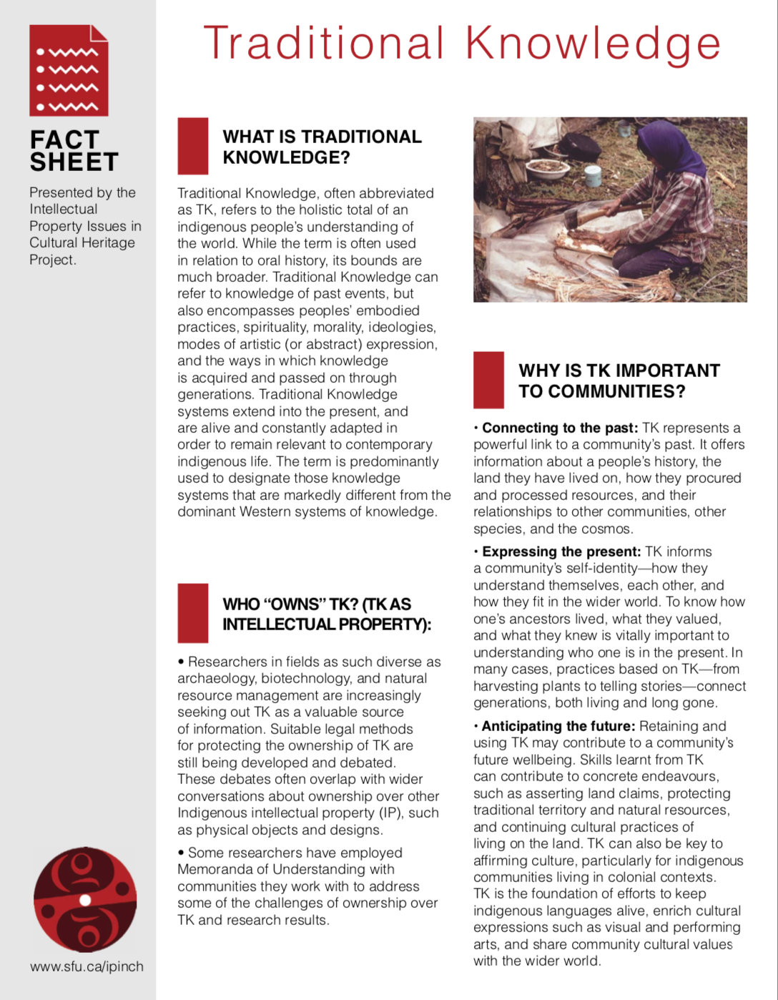
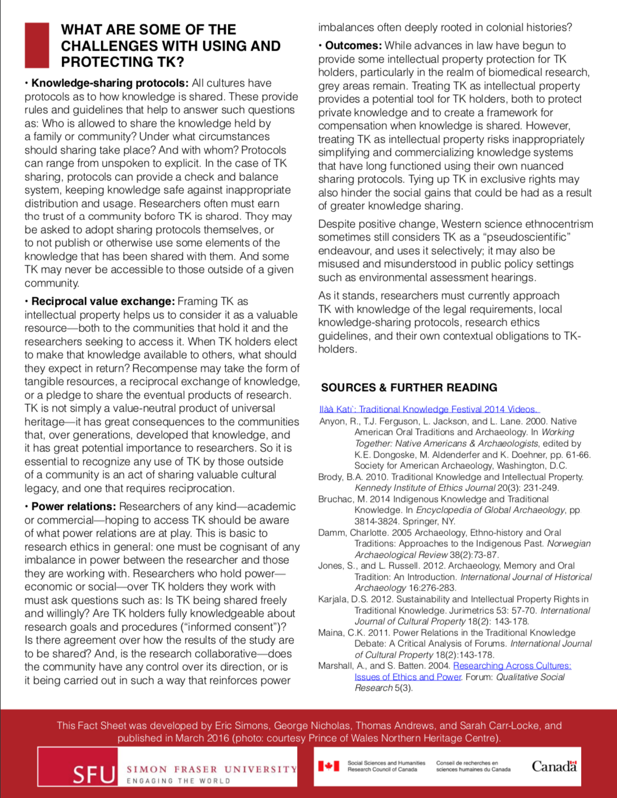

# Appendix Five: IPinCH Traditional Knowledge Fact Sheet

Reproduced with permission from George Nicholas, [IPinCH](https://www.sfu.ca/ipinch/) Project Director, from [https://www.sfu.ca/ipinch/sites/default/files/resources/fact_sheets/ipinch_tk_factsheet_march2016_final_revised.pdf](https://www.sfu.ca/ipinch/sites/default/files/resources/fact_sheets/ipinch_tk_factsheet_march2016_final_revised.pdf).
