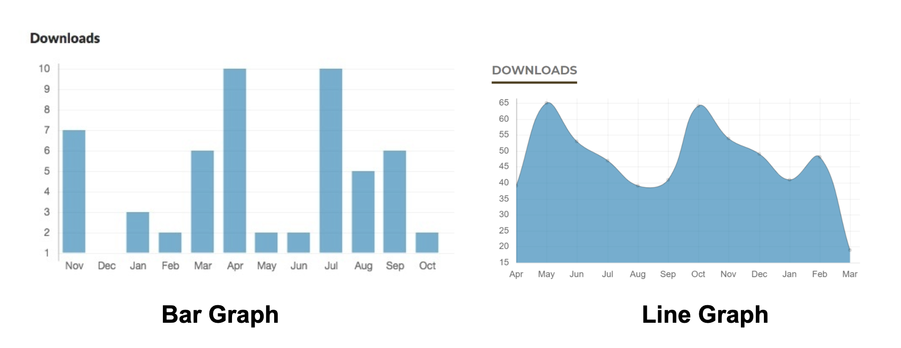
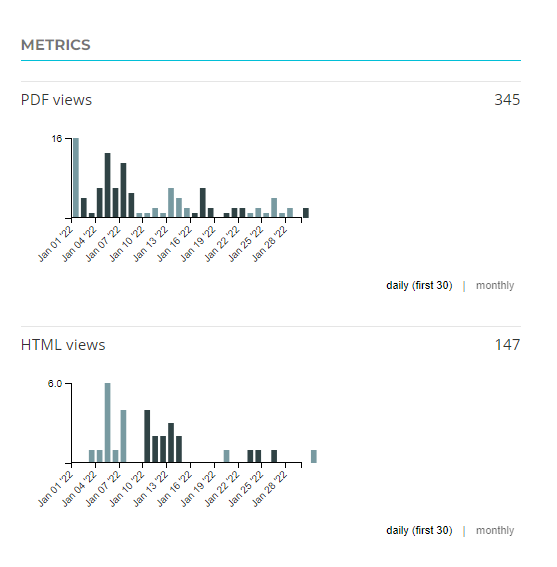
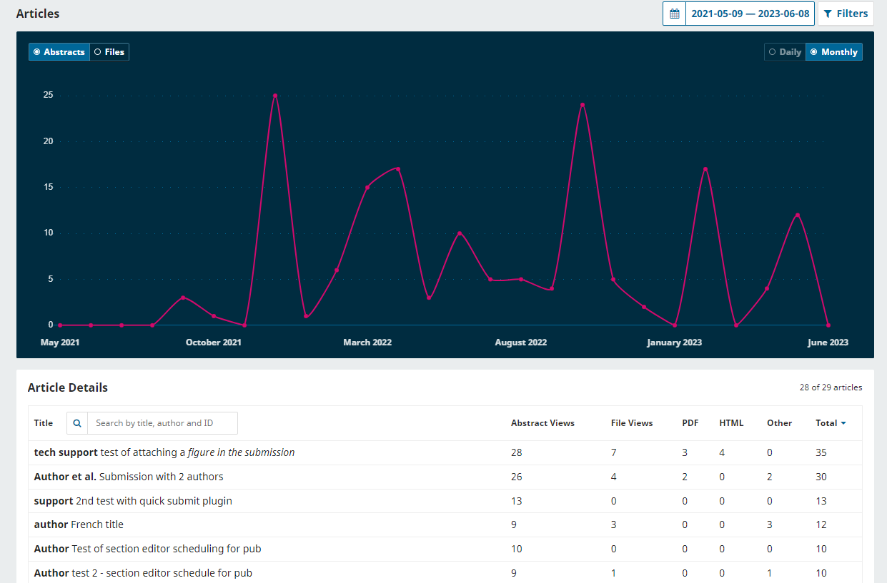
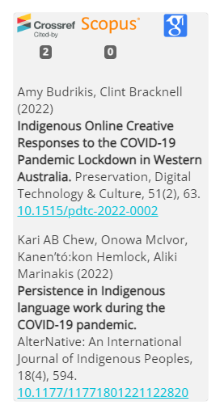
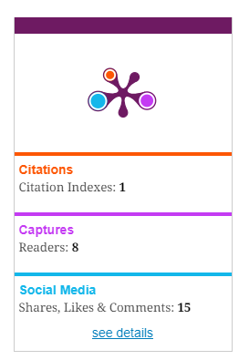

# Visibility, Discoverability, Impact, Promotion

These sections summarize strategies that will help expand your readership beyond the campus community, help potential authors identify the journal as a possible place of publication, and help editors analyze your journal’s impact in the field. More details are outlined in PKP’s [Getting Found, Staying Found](https://docs.pkp.sfu.ca/getting-found-staying-found/en/) guide. If your journal is affiliated with an institution, contact your institutional contact or librarian for assistance and check about the allocation of responsibility for the following tasks.

## Visibility 

Visibility is about creating the first impression for journal website visitors. Can they easily understand what the journal is about, who is running it, and how to access its content? Can a potential author easily find submission requirements and contact information? Below are a few easy strategies to help improve visibility.

### Journal information

Make sure the journal website makes the following information explicit and easy to find:

 **1.  Who you are**
* Journal title
* The affiliated institution(s) and/or department(s)
* Names and affiliations of the editorial board members
* Journal’s [ISSN](./visibility-impact#issn)
* Journal’s publisher (an entity or a group of people that makes decisions about journal’s operations and policies - this can be your department, student union, library, or editorial team)

**2.  What you do**
* Journal’s aim and scope. The aim is the main objective that the journal is trying to accomplish. The scope is how the journal will accomplish the aim. These may include:
* What subjects are covered by the journal
* What types of articles the journal does or does not publish
* Which gaps in scholarly communications you are trying to fill
* Who can submit to the journal
* What kind of review the journal performs, etc.
 
**3.  How to contact you**
* Up-to-date email or contact form
* Consider using a generic rather than personal email to share mailbox access with current and future editors

**4.  How you operate**
 * Author submission guidelines
 * Submission process
 * What to expect after the submission is made
 * Review process
 * Any other costs associated with submission or publication
    
**5.  How to access content**
* Is it openly accessible or subscription-based?
* Copyright and/or licenses under which content is available
* Where the journal is indexed
 
### Domain Name / URL

If your journal is hosted by your library or institution, it likely has a URL that includes your institution’s name and may be quite long. You can choose to register a different domain name for your journal to keep the URL straightforward and easy to remember. You may want to get your country-level domain (e.g., .ca), nonprofit (e.g., .org), or more general (e.g., .net).

There are several websites / domain registrars that allow you to register a unique domain name for a relatively affordable annual fee, and some include email inbox features. Your institution may be able to recommend one to use, or include domain management as a part of their service. Coordinate with your institution to set up and/or direct your OJS site to the new URL.

Note that if purchasing your own domain, **you will be responsible for renewals and payments**. Ensure future editorial teams will have sustainable funds to maintain and know how to handle them. Missing a domain renewal will make your journal inaccessible.

### ISSN

An ISSN (International Standard Serial Number) is a unique 8-digit code used to identify a print or electronic periodical publication, e.g. “2561-7397”. It helps distinguish between journals with the same title and is necessary to keep track of statistics, use DOIs, and apply for indexing.

**To obtain an ISSN:**
* First check on [ISSN Portal](https://portal.issn.org/) whether your journal already has an ISSN, and if the information is accurate.
* Check if you need to apply via the [international](http://www.issn.org/services/requesting-an-issn/) or a [national centre](https://www.issn.org/services/requesting-an-issn/contact-an-issn-national-centre/) (e.g. in Canada applications are managed by [Library and Archives Canada](https://library-archives.canada.ca/eng/services/publishers/issn/pages/obtain.aspx)).
* Check your centre’s application requirements. Usually a journal needs to have published 3-5 articles before an ISSN can be registered.
* Display your ISSN on your journal website (e.g. in the footer, sidebar, masthead or About page) and on formatted articles.

Note that print and digital formats need separate ISSNs, and if your journal title changes, you will need to request a new linked ISSN for the new title.

### DOI numbers

DOI (Digital Object Identifier) is a number sequence used to uniquely identify an online resource, such as and individual article, e.g: [https://doi.org/10.33137/tijih.v1i2.36047](https://doi.org/10.33137/tijih.v1i2.36047)

DOIs provide stable links to digital journal content: even if an article moves, its DOI should not change. **Having a DOI assigned makes it significantly easier to cite an article and track its usage and citations**.

DOIs are purchased through Registration Authorities such as [Crossref](https://www.crossref.org/services/content-registration/), [DataCite](https://datacite.org/dois.html) or [mEDRA](https://www.medra.org/). Check whether your institution/library already has an arrangement with an agency and whether your journal can use this service.

PKP provides [documentation on how to set up DOIs in OJS](https://docs.pkp.sfu.ca/crossref-ojs-manual/en/) and how to use a few related plugins for statistics and citation tracking.

### OJS content enhancement plugins

OJS comes with a few content enhancement plugins that can help **boost a journal’s visibility and usability**:

* [Citation Style Language Plugin](https://docs.pkp.sfu.ca/learning-ojs/en/settings-website#citation-style-language-plugin) adds auto-generated citation in different styles to article landing pages.
* [Most Read Articles Plugin](https://docs.pkp.sfu.ca/learning-ojs/en/settings-website#most-read-plugin) creates a “most read articles” section in the journal’s sidebar with the 5 most viewed articles (with links) in the last week, along with the number of views per article.
* [Recommend Similar Articles](https://docs.pkp.sfu.ca/learning-ojs/en/settings-website#recommend-similar-articles-plugin) and [Recommend Articles by Author](https://docs.pkp.sfu.ca/learning-ojs/en/settings-website#recommend-articles-by-author-plugin) plugins insert a list of recommended articles on the article landing page.
* [Keyword cloud](https://docs.pkp.sfu.ca/learning-ojs/en/settings-website#keyword-cloud-plugin) displays a cloud of keywords in the sidebar that can be clicked to navigate to tagged content.
 
These plugins should be available in the journal’s Plugin Gallery for you to enable - if not, ask your OJS platform administrator to install them.

## Discoverability

Discoverability is about readers and potential authors being able to find your content. Discoverability strategies may include getting your journal listed in directories, indexes, and databases. For an overview of different types of indexes and databases, see [Getting Found, Staying Found: Indexes and Databases](https://docs.pkp.sfu.ca/getting-found-staying-found/en/getting-found-visibility#indexes-and-databases).

For a webinar overview of these discoverability strategies see the **[video recording](https://ualberta.aviaryplatform.com/playlists/307/show/playlist_resource_id/8442/collection_resource_file_id/181149) and [slides](https://hdl.handle.net/1807/127666)** from the **Tips and Tricks to Make your Journal Content Discoverable Online** presentation at the Student Journal Forum 2023.

### Search engines

**[Google](https://www.google.com/)** crawls the web and automatically adds new sites to its index, but it can take some time for Google to find new URLs. If you can’t find your journal on Google, you can [submit your URL manually](https://www.google.com/webmasters/tools/submit-url).

**[Google Scholar](https://scholar.google.ca/)** identifies scholarly papers based largely on their format. [PKP’s Google Scholar Indexing guide](https://docs.pkp.sfu.ca/google-scholar/en/) provides guidance around the indexing of OJS journals in Google Scholar.

[Google Scholar’s inclusion guidelines](https://scholar.google.com/intl/en/scholar/inclusion.html) specify that **articles should meet the following criteria**:
* Articles should be in PDF format.
* Content formatted as individual articles are easier to index, and preferable to a single large file containing an entire issue.
* The title of the paper should appear in a large font at the top of the first page.
* The authors of the paper should be listed below the title on a separate line.
* There should be a bibliography at the end of the paper.

**Your choice of a publishing platform** may significantly affect your inclusion in Google Scholar:
* Dedicated publishing platforms, such as OJS, are set up to expose metadata and articles in the way Google Scholar’s crawlers expect. Double-check that your Google Scholar plugin is installed and enabled.
* General-purpose websites (e.g. WordPress, Drupal, SquareSpace, etc.) do not always support Google Scholar indexing by default, but might have special functionality that you need to enable.
* File storage solutions, such as Google Drive or Dropbox are generally not discoverable by search engines.
* Display platforms like [ISSUU](https://issuu.com/) convert your PDF into an image that is not readable by search engines. If you use them, make sure you have another way of distributing your content as readable text/PDF with respective metadata.
 
For further instructions, see the [Google Scholar Indexing guide](https://docs.pkp.sfu.ca/google-scholar/en/) and [Getting Found, Staying Found: Search Engines](https://docs.pkp.sfu.ca/getting-found-staying-found/en/getting-found-visibility#search-engines).

### Directories

Most directories list journal titles with description, but some also include links to full-text articles. Consider including your journal in the following directories:

**1.  [The Directory of Open Access Journals](https://doaj.org/) (DOAJ)**

DOAJ indexes high quality, open access, peer-reviewed journals. It accepts student journals that have “an advisory board for the journal where at least two members have a PhD or equivalent qualification.” OJS also comes with a DOAJ export plugin that allows you to send your article metadata to DOAJ.

Check if your institution’s library provides assistance with preparing a DOAJ application. Here are additional application resources:
* [DOAJ’s guide to applying](https://doaj.org/apply/guide/)
* [PKP's DOAJ application guide for OJS journals](https://docs.pkp.sfu.ca/doaj/en/)

**2.  [CUR’s Undergraduate Research Journal Listing](https://www.cur.org/engage/undergraduate/journals/listing/)**

This self-entry list maintained by the Council on Undergraduate Research (CUR) displays undergraduate journal’s name and blurb and does not have inclusion or evaluation criteria. To add your journal, [fill out this short web-form](https://www.cur.org/engage/undergraduate/journals/submission/).

**3.  [UlrichsWeb Global Serials Directory](https://ulrichsweb.serialssolutions.com/)**

UlrichsWeb is a subscription directory of journal information. You might have access to it via your library’s subscription. To have your journal’s included, [send them an email with journal information](https://www.ulrichsweb.com/ulrichsweb/faqs.asp#Updating_Ulrichs).

### Databases and indexes

Databases are searchable collections of journal articles with metadata and full-text articles. Indexes are similar, except they only contain metadata (article title, authors, abstract, etc.). For more details on the different types of indexes and databases, see the [Getting Found, Staying Found: Indexes and Databases](https://docs.pkp.sfu.ca/getting-found-staying-found/en/getting-found-visibility#indexes-and-databases).

Many indexes and databases will consider student journals for inclusion, or reach out to journals they are interested in. Because the application process can be quite involved, start by selecting and prioritizing where to apply first:

1.  **Make a wish list** of indexes and databases you want to get into:
* Where are journals in your discipline indexed? Check [Ulrichsweb](http://ulrichsweb.serialssolutions.com/) via your library subscription.
* Which journals are cited in your articles’ bibliographies - where are they indexed?
* What databases are used in your discipline?
* A subject librarian in your discipline and/or your faculty advisor may also offer useful recommendations.  

2. **Check application requirements** and consider which applications should be part of the short, medium vs long-term planning:
* [PKP's Index Application Guide](https://docs.pkp.sfu.ca/indexing-guide/en/) summarizes the requirements for a few known indexes, such as Web of Science, Scopus, and PubMed.
* Index/database websites would usually outline their requirements and process, or have contact information to request these details.
3.  **Keep records** of all your applications - you will be reusing a lot of the same content.
4.  Some **revisions to your journal might be required**; for example, transparent policies about editorial processes and/or fees.
5.  **Pass the details** of successful, in progress, or declined applications to the new editorial teams during succession.
6.  When accepted, **list the databases & indexes** publicly on your journal’s website.
7.  **If journal policies change** in the future, double-check that they do not contradict inclusion requirements so that the journal can remain indexed.
8.  **Regularly check** who is indexing you and confirm that your status is up-to-date.
    

### Library catalogues

A simple way to make your journal more accessible is to have it included in your university’s library catalogue or e-journal list. Once your journal has published 2 or 3 issues, consider approaching a librarian and requesting that the journal be included in the library catalogue and e-journal list. The library will need your [ISSN](./visibility-impact#issn).

## Impact

There are many different ways to track impact at the journal, article, and author level. See [Getting Found, Staying Found: Research Impact Metrics](https://docs.pkp.sfu.ca/getting-found-staying-found/en/getting-found-increasing-impact#research-impact-metrics) for various ways of measuring these metrics.

### Article downloads

You can **enable and display article downloads in OJS** using the following tools:

* [Usage Statistics Plugin](https://docs.pkp.sfu.ca/learning-ojs/en/settings-website#usage-statistics-plugin) displays publicly the number of article downloads on the article page, in bar or line graph format. Depending on your OJS version, it may require Administrator access to be enabled.

    

* [Paperbuzz Plugin](https://github.com/pkp/paperbuzz) displays publicly galley views in addition to Altmetrics (./visibility-impact#altmetrics).

  

* [Article stats visualization](https://docs.pkp.sfu.ca/learning-ojs/en/statistics#articles) shows to the journal manager/editor (internally) the graph and table representations of article usage, including abstract views and full-text downloads.

  
    
### Citation statistics 

You can **track and display citation statistics** in the following ways:

1.  Google Scholar’s [citation tracking](http://scholar.google.com/citations) for authors. This free tool can be used with any journal platform indexed by Google Scholar. It allows authors to see how many times and where their article was cited. Authors must register for an account, and complete a user profile.
2.  [OJS Crossref/Scopus plugin](https://docs.pkp.sfu.ca/crossref-ojs-manual/en/citationsplugin) adds to OJS article pages a display of citations and citation counts from Scopus, Crossref, Google Scholar and/or Europe PubMedCentral. Crossref membership is required to display citation counts from Crossref.

      

### Altmetrics

Altmetrics (alternative metrics) looks at readers’ engagement with articles via social media views and discussions, bookmarking, and referencing (beyond traditional citation counting).

There are several **altmetric tools** for which OJS has plugins:
* [Paperbuzz Plugin](https://github.com/pkp/paperbuzz) - displays Twitter mentions in addition to galley views (DOIs are required for metrics).
* [Plum Analytics Plugin](https://github.com/ulsdevteam/ojs-plum-plugin) - displays PlumX widget that breaks down citations and social media mentions (DOIs are required for metrics).

         

### Readership statistics 

Tracking readership statistics can help you understand your audience. These statistics will show whether you are reaching your target audience, and provide information about how readers are interacting with your journal. This data can help you promote your journal more effectively.

Most content management software includes features for tracking page views and downloads. Make sure that any tool you use is transparent in your privacy policy and compliant with your jurisdiction or country. 

**In OJS, you can use the following tools**:
* [Usage Statistics Report](https://docs.pkp.sfu.ca/learning-ojs/3.3/en/statistics#usage-statistics-report) provides granular data on monthly views for the journal homepage, issue TOCs, article abstract/landing pages, and file views in CSV format.
* [Custom Report](https://docs.pkp.sfu.ca/learning-ojs/3.3/en/statistics#generate-custom-report) allows you to generate a granular usage report, including breakdowns by countries and time periods.

External tools like [Google Analytics](https://analytics.google.com/analytics/web/#/) and [Matomo](https://matomo.org/) can be used via the respective OJS plugins; [Plausible](https://plausible.io/) can be configured using the “Custom Header” plugin. These tools allow you to collect more detailed information, such as seeing how long people are spending on each page, tracking unique and repeat visitors, and monitoring how frequently visitors view your site, etc.

## Promotion

Student journals can be promoted through departmental websites, mailing lists, classroom visits, posters, social media, and word of mouth. If your goal is to expand your readership beyond your campus community, the [Getting Found, Staying Found: Promotion and Marketing](https://docs.pkp.sfu.ca/getting-found-staying-found/en/getting-found-visibility#promotion-and-marketing) provides an overview of strategies for making your journal more visible in academic communities and on the web.

Here are a few **strategies used by student journal editors to promote their content**:
* Use OJS’s social media plugins, such as the [Shariff plugin](https://github.com/ojsde/shariff) to add social media sharing buttons to article landing pages, sidebar or footer.
* When sharing articles, encourage authors to use DOIs, for consistency and tracking.
* Create and publicize brief video abstracts. See [Learning OJS guide for instructions on publishing multimedia](https://docs.pkp.sfu.ca/learning-ojs/en/production-publication#prepare-and-add-galley-files).
* Host open webinars for each published issue with authors invited to talk about their work.
* Host a regular conference that both helps create an audience and generate a steady flow of submissions.
* Manage journal’s presence on or invite authors to post their articles on ResearchGate and Academia.edu.
* Run a social media group that attracts an audience by sharing research, job, and volunteering opportunities in the field. 

