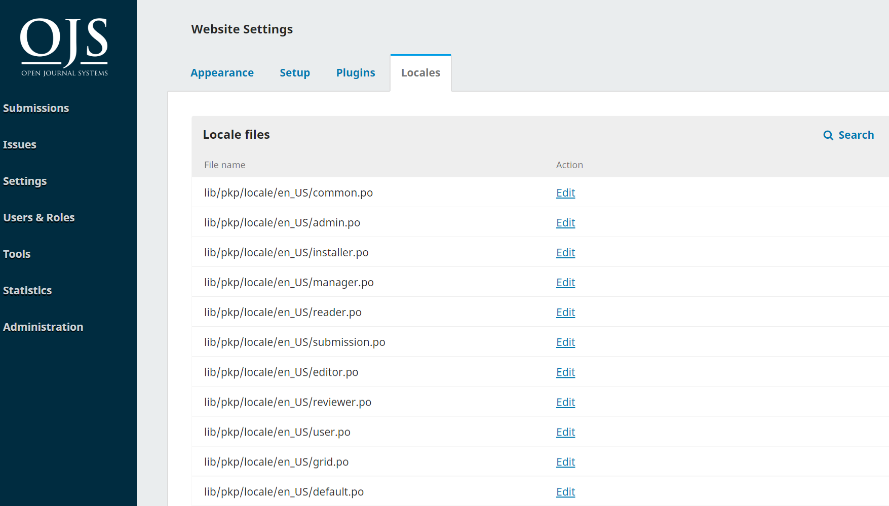
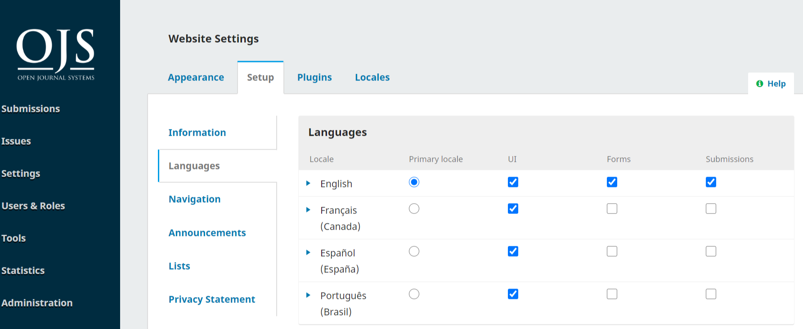
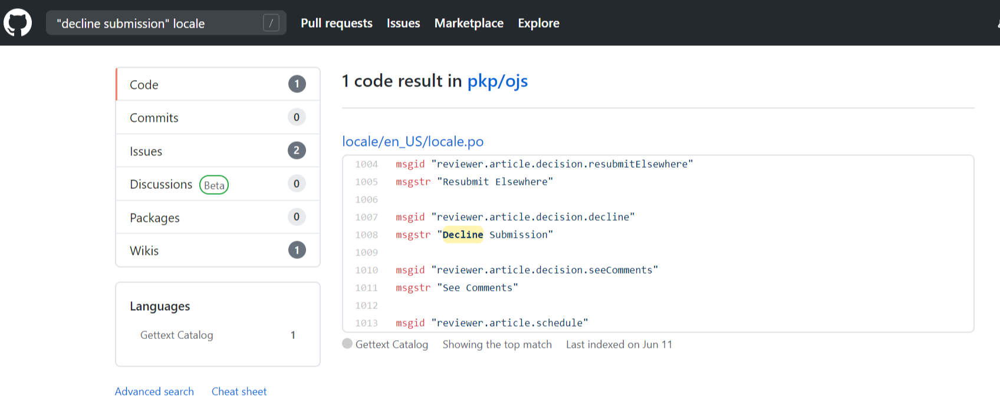
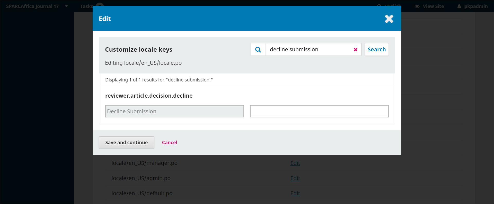
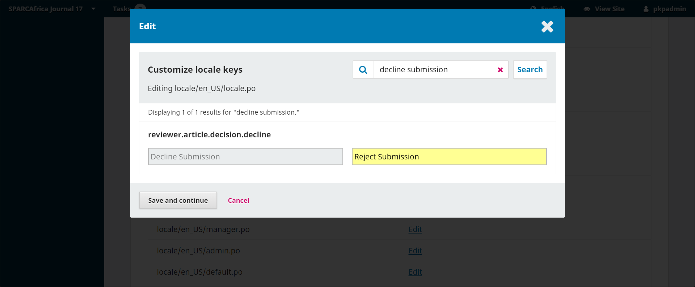

# Customize a Translation Locally

You can use the Custom Locale plugin to customize or change a translation on your local installation. It also allows you to customize text on your OJS journal, OMP press, or OPS server in any language that is installed and enabled. For example, if you want to change the text displayed on the review recommendation buttons in the submission workflow, you can use the Custom Locale plugin.

The Custom Locale is only reliably available and operational for OJS/OMP/OPS 3.2.0 and newer.

If you want to make a translation that other users can benefit from, it is better to translate in Weblate. But there are some situations in which customizing a translation on your local installation is preferred, and the Custom Locale plugin allows you to do this. This chapter explains how to use the plugin.

Please see [How Languages and Locales Work](https://docs.pkp.sfu.ca/translating-guide/en/managing-languages#how-languages-and-locales-work) in this guide for an explanation of how languages and locale files work in PKP software.

## Install and Enable the Custom Locale Plugin

First, ensure that the plugin is installed and enable it:
1. Go to Settings > Website > Plugins
2. Find the Custom Locale Plugin in the list of Installed Plugins (if it is not listed with the Installed Plugins, check the Plugin Gallery and you may need to install it first)
3. Click the box to enable it
4. Click the blue arrow next to the plugin name and then the *Customize* link that appears below it. This will refresh the page and now you should see a new tab in the Website Settings menu called *Locales*.

## How the Custom Locale Plugin Works

Under the Locales tab you will see a list of locale files that contain all of the message keys that appear as text on your site, for the locale you have set as the Primary Locale under Website Settings > Setup > Languages. So, if you have more than one language on your site but Português (Brasil) is the Primary Locale, the locale files you see in the Locales tab will be for the Português (Brasil) language.



If you want to edit the locale files for a different language installed on your site, you will need to temporarily set it as the Primary Locale and then change the Primary Locale when you’re finished editing the locales.



You can open a file, find a message key in it, and enter a custom value to change how that piece of text appears on your site.  These files correspond to the locale files in the locale folders of your site installation.  The plugin provides a way to access these files directly.

Each file in a locale folder is a collection of message keys categorized by topic, based on what feature or function they pertain to in the software application.  For example, most message keys related to an editor’s work are in the locale/en_US/editor.po file, while message keys for the ORCID profile plugin are in the plugins/generic/orcidProfile/locale/en_US/locale.po file.

An additional tricky thing to keep in mind is that every installation of OJS, OMP, or OPS has 2 sets of locale files – 1 in a folder called lib/pkp/locale, which are for files that are common to all PKP software applications, and 1 in a folder called locale, which is for files that are specific to the application (OJS, OMP, or OPS).  For example, all of the English OJS email templates are in the ojs/locale/en_us/emails.po file. Whereas all of the English message keys related to user accounts are in the pkp-lib/locale/en_us/user.po file.

Finally, keep in mind that locales and message keys can change between different versions of PKP software.

## Find the Locale File to Edit
Because the message keys are saved in multiple different files and you can only search within a file, before you can edit a message key you need to figure out which file it is in. There are a few different ways to do this.

### Guess
Thinking about the above information about how locale files are organized, you can make a guess about which file the message key is in. Find the locale file in the list under the Locales tab and then follow the instructions below on how to edit the message key.

You may need to search in more than one file before you find the message key. And you may not be able to find it by guessing and have to use another method.

### Search the locale files in Github
PKP’s Github repository contains sets of all of the locale files that are in your installation. So you can search the repository for the message key, identify which file it is in, and then search for the message key in the file on your installation.

As explained above, the relevant locale file may be in the pkp-lib repository or the ojs/omp/ops repository.

Go to the [pkp-lib repository](https://github.com/pkp/pkp-lib) and search for the message key you want to customize. You can put quotes around the key to make the search precise.

So, if you want to customize the English text for “Decline Submission,” you can do the following search: “decline submission” locale

You can also use the search tools to make a more specific search query.  For example, if you are searching for the message key “current issue” in an English locale file you could go to https://github.com and do the following search: org:pkp "Current Issue" path:locale/en_US language:"Gettext Catalog"

If you don’t find the text in the pkp-lib repository, try searching in the [ojs repository](https://github.com/pkp/ojs)

In your list of search results, refine the results to **Code** and find the right locale file in the results.



Note of the locale file name so you can find it in the Custom Locale Plugin interface. Skip to the section _____ below.

### Search with command-line tools

You can also search using command-line tools on your server (or development machine).

For example, if you are searching for the message key “current issue” in an English locale file you could use the following command:
```
$ find . -name \*.po -exec fgrep -l "\"Current Issue\"" "{}" ";"
```

You would get the following result, which would indicate the text could appear in those two files: ./locale/en_US/editor.po ./locale/en_US/locale.po

## Edit the Message Key

Now that you have determined which locale file the message key is in, you can edit it.

1. Go back to your OJS/OMP/OCS site
2. Go to Website Settings > Locales
3. Find the locale file you identified in the previous search exercise
4. Click **Edit** next to the locale file name to open it
5. Enter the message key you want to customize in the **Search** box and click **Search**



6. In the empty box, enter what you would like the customized text to say. It will turn yellow as you type, to indicate you are making a customization.



7. Click **Save and Continue**

Now you can visit the part of your site where the customized text appears and check that the change has been made. 
