# Translate PKP Documentation

PKP uses a different tool for translating documentation called Crowdin, which is compatible with markdown - and so better suited for translating documentation than Weblate. This chapter explains how to use Crowdin, find documentation to translate, proofread documentation, and maintain translations.

You can translate documentation directly in GitHub without using Crowdin and the section “Translate without Crowdin” explains how to do that, but we still recommend reading this chapter to understand how documentation translation works as a whole.

## PKP Documentation

First of all, thank you for considering contributing your time to translating PKP’s documentation! PKP creates and maintains many different guides on using, administering, and developing PKP software applications, as well as other guides about scholarly publishing. Our published documentation can be found in the [PKP Docs Hub](https://docs.pkp.sfu.ca/).

Documentation is coordinated, created, and maintained by the Documentation Interest Group, as well as other PKP staff and community members. We are always improving documentation - from creating new guides to updating documentation as the software and its features change.

Most of our documentation is created in English and then translated into other languages, but original documentation in other languages is welcome. If you would like to create and update documentation or are just interested in learning more about how documentation works, check out our [Guidelines for Contributing to PKP Documentation](/contributing/en/) or contact us at documentation@publicknowledgeproject.org.

## Documentation Translation Workflow

Documentation translation is integrated with PKP software translation, and the workflow is similar. Translation of PKP software and documentation is done by PKP software users around the world. Translators can translate one guide or many.

PKP has a Translation Coordinator who coordinates translators and translations and approves and merges translations.

Larger language groups may have a Language Moderator who coordinates translators and translations in that language and reports to the Translation Coordinator. The smaller language groups are coordinated directly by the Translation Coordinator.

Anyone with fluency in multiple languages and some understanding of the software and scholarly publishing context is welcome to contribute to translation. We especially appreciate translators who can commit to maintaining a translation over the long term. If you have multilingual fluency but no experience with our software, please use the documentation resources noted above to learn about our software before you start translating. Additional resources are noted below under **Choose the Right Words**.

If you’re interested in being a Language Moderator for a particular language, please contact  [documentation@publicknowledgeproject.org](mailto:documentation@publicknowledgeproject.org). Language Moderators are required to make a minimum 2-year commitment to moderating the language. Language moderators should have excellent translation skills and knowledge of PKP software, as they are responsible for reviewing and approving translations. They should also have a relationship with and understanding of the user community for the language, so they can effectively coordinate and recruit translators.

## Get Started

To get started translating PKP software documentation, you can follow the instructions in this guide. If you have questions you can contact the Translation Coordinator or your Language Moderator. You can also talk to other PKP translators and ask questions in the [PKP Community Forum](https://forum.pkp.sfu.ca/c/translations/12).

Our documentation translation is done at [pkp-documentation.crowdin.com](https://pkp-documentation.crowdin.com/). You will first need to [register an account](https://pkp-documentation.crowdin.com/u/signup?hash=b474e82e87e7052ee7c99c1f3234584a43).

Once you have registered, you can select the language you are interested in translating from the Project Home screen. From there, you can select the folder containing the files of the documentation you wish to translate. The relevant markdown files are located in the “en” folder under each guide.

If your language is not yet available on Crowdin, please contact [documentation@publicknowledgeproject.org](mailto:documentation@publicknowledgeproject.org).  

### Choose a translation project

Consider the following when choosing a document to translate.

#### Documentation needs and priorities of your language group

Is there one document that would be more useful to other PKP software users who speak your language than others? If so, you may want to translate that document first.

You can ask the language moderator for your language if they know of any documentation needs or priorities for your language group. You can also inquire with regional user groups.

#### The size of translation project you want to do right now

Think about how much time you can commit to this current translation project. Once you begin a translation project, it is best to finish it within one or two weeks.

Documents vary in size. A few documents, like Learning OJS, have more than 10 chapters and some chapters are quite long. However, most documents have approximately 5 chapters that are 1-3 pages each.

Translation is done in chapter files and paragraphs, so you can choose to only translate a chapter or even only a few paragraphs in a chapter. You may find a document that is mostly translated and only needs a small part of it translated. However, if there is an entirely un-translated document, it is best if you can commit to translating the whole document or at least a thematic section of it. The translation will not be published until the entire document (all files/chapters) have been translated.

You will see various folders with the titles of the documentation accompanied by progress bars. The blue part of the progress bar represents the translation progress, while green represents proofreading progress. You can hover over any progress bar in Crowdin to see the word count for the folder or file.

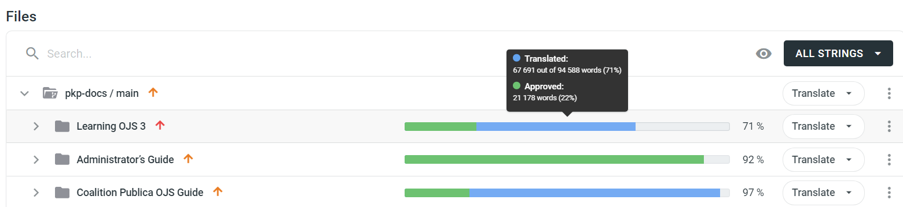

You can check the size of an individual chapter or documentation component by opening the folder, and then opening the "en" folder to see the individual markdown files and their progress.

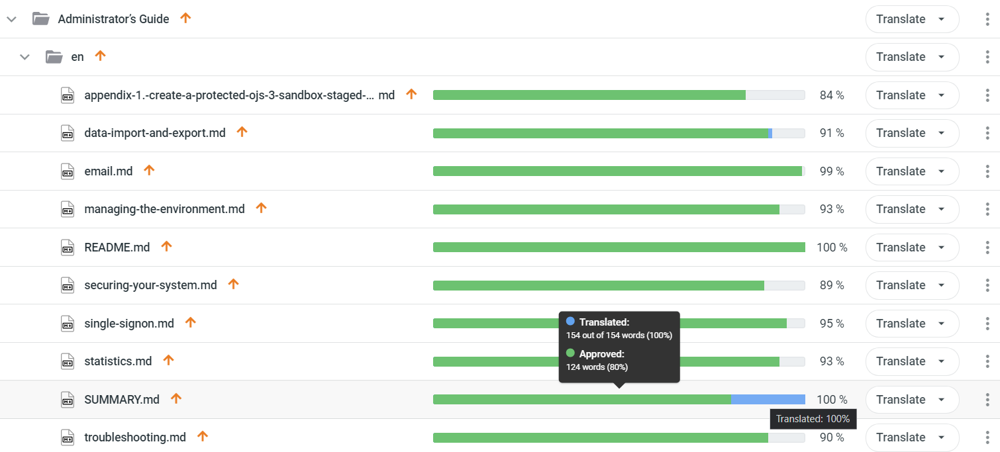

## Translating in Crowdin

Once you decide on a project, you can start translating.

After you've selected your language from the project home and navigate to the guide/chapter you would like to translate, you can click on the .md file you wish to translate to launch the editor. The chap1ter files are listed in alphabetical order. We recommend that you start by translating the SUMMARY.md file. After that you can translate the files in any order you want, but it may be easier for you to translate the files in their logical order. If so, you can open the guide in the [Docs Hub](https://docs.pkp.sfu.ca/) to see what order the chapters are in and follow that order.

Starting with the SUMMARY.md file, open the file. This will launch the Editor mode, which contains a three-panel interface.

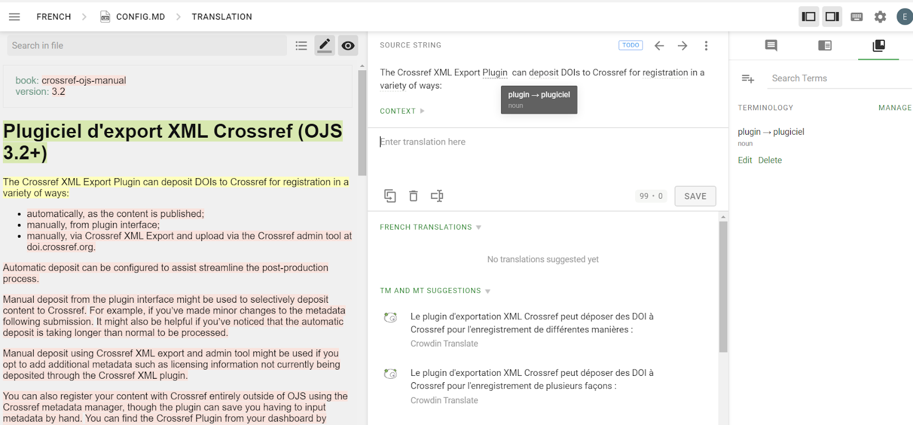

**Left panel**: The panel on the left shows the formatted text and translation status for each string.

Translated strings are highlighted in green, with the translation shown in the context of the document.

The string actively being worked on and shown in the translation panel in the center is highlighted in yellow.

Red highlighted strings are untranslated.

Please be sure to scroll all the way down to “Hidden Texts”, which will include strings used for alt text tags necessary for screen readers.

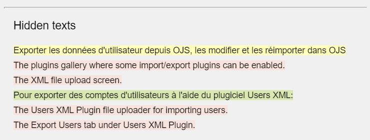

**Center panel**: Your main translation workspace will be in the center panel, where you can enter your translations.

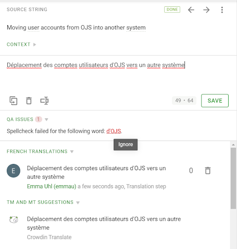

View the translation status of the source string at the top of the panel, and use the arrow icons (or Ctrl+Up and Ctrl+Down) to move forward or backward through source strings.

Hover over underlined words in the source string to see suggested translations or glossary entries related to the selected word.

Enter your translation in the space immediately below the source string.

You can copy the source (Ctrl+Shift+C) or clear any entered translations (Ctrl+D) using the icons beneath the translation area or the keyboard shortcuts.

After saving, Crowdin will provide automatic QA feedback. If you want to ignore a spell check issue, simply click the word under QA Issues to dismiss it.

Beneath the QA Issues section is the Translation Memory and Machine Translation suggestion area. This will show all past translations saved to the string, as well as suggestions from Crowdin's Machine Translation feature.

Double-click to insert a suggestion into the translation field.

If you wish to select and copy only part of a translation suggestion, click the "Text Selection" icon found beside the Copy Source (box with arrow) and Clear icons (trash can).

**Right panel**: The right panel contains three tabs indicated by icons, from left to right: Comments, Search TM, and Glossaries. Each of these functions will be described in more detail below.

You may also want to review [Crowdin’s excellent documentation](https://support.crowdin.com/online-editor/) for further information on the Editor interface.

### Right Panel Functions

#### Comments and Questions

If you are unsure about the context or meaning of a source string, unsure of your own translation, have questions about terminology, etc., it is highly recommended that you leave a comment. Even if you are currently the only translator for your language, commenting to record any of your doubts and concerns can be helpful to future translators looking to understand translation decisions.

Simply access the comments tab from the “speech bubble” icon in the right panel. From there, enter and save your comment. You can also reply to existing comments, including using the @ symbol to tag other users in the discussion.

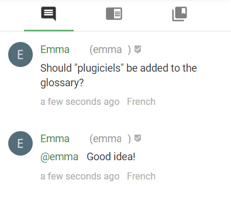

You can also flag something as an issue when you leave a comment. This is particularly useful for notifying our team if you notice something incorrect in the source (English) documentation - a typo, missing or duplicated words, or unclear/incorrect/misleading information, but you may also choose to use this feature to highlight other issues preventing progress in the translation.

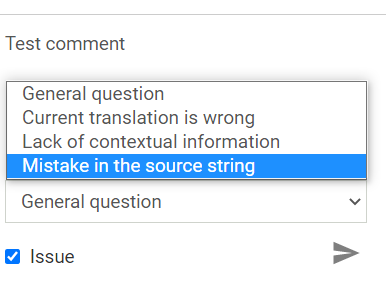

#### Search TM

Click the “open book” middle icon on the right panel to open the Search TM (Translation Memory) window. Here, you can search past translations to see how terms and phrases have previously been translated.

Crowdin will show you the most common translation for your search keywords (press the arrow beside "Previous Translations" to expand this list as needed), as well as strings containing exact or near matches to your search.

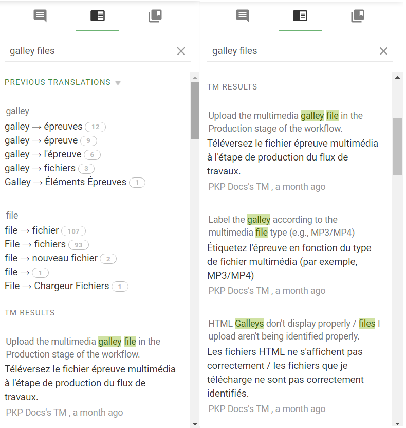

This can be useful for reducing your workload when translating similar strings and keeping consistency throughout the translation.

#### Glossaries

When translating software documentation, it's important to use terminology that is consistent with the software application and is commonly understood by users. Using the glossary function is a way to keep consistency between different translators, different guides, and even between the guides and the software's interface.

Glossary terms can be referenced or added into Crowdin while working in the editor from the Terms tab of the right hand panel, or from Resources > Glossaries in the project view.

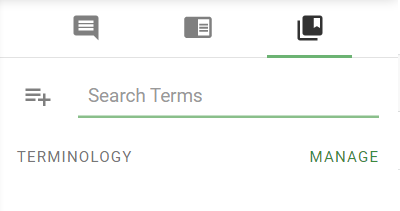

To add a new glossary term, simply click the "Add Term" icon with the + symbol beside the "Search Terms" box and fill out the relevant information. You are not obligated to add any terms to the glossary, but it can be very helpful, especially when trying to match terminology used in the localized version of OJS, OMP, etc.

If the term you are looking for is not yet in the glossary, there are a few resources for finding existing translations of the term:

- Check an installation of the software that the guide is about (e.g., OJS) with the language you are translating the document into installed and enabled. PKP maintains test drive demo sites for [OJS](https://pkp.sfu.ca/ojs/ojs_demo/), [OMP](https://pkp.sfu.ca/omp/omp_demo/), and [OPS](https://pkp.sfu.ca/ops/demo/). If your language is not installed here and you need assistance accessing an installation in your language, you can [Contact PKP](https://pkp.sfu.ca/contact-us/).
- PKP software translators maintain glossaries on a per-language basis of standard translations of technical terms. You can check the glossaries in the [software translation tool](https://translate.pkp.sfu.ca/dictionaries/pkp-lib/) on the language page, and if you create a Weblate account you can add terms to the glossary.
- You can post questions about terminology in the [PKP Community Forum](https://forum.pkp.sfu.ca/c/translations/12), which is a community discussion space for PKP translators. You will need to register to post a question.

## Proofreading Documentation Translation

The proofreading step is optional, but it is recommended when there are non-native translators, larger teams, student translators, or other situations where feedback is feasible, desirable, and/or helpful. All registered users are registered as both translators and proofreaders; however, proofreading should be done by language moderators or a person designated by the language moderator.

You can switch between the translation and proofreading stages by clicking on the arrow beside the “Translate” button in the project view.

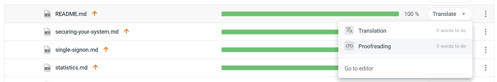

Alternatively, if you already have the editor open, you can click the menu in the upper left corner and select “Workflow” to choose your desired stage.

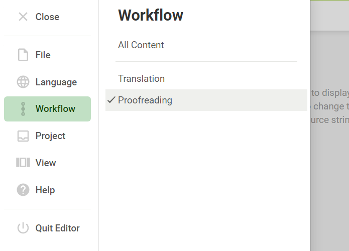

Crowdin's proofreading interface will provide you with various QA warnings. You can click spellcheck suggestions to ignore them throughout the document, or add any necessary corrections directly to the string.

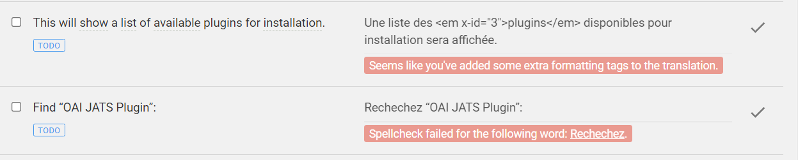

Click any string to edit it if it requires a correction.

When you want to approve a string, click the checkmark button to the right of the string. The status of the string will update from “TODO” to “DONE”.

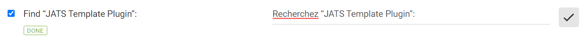
An approved string in Crowdin with the “DONE” status.

The filtering feature located next to the "Search in file" bar is particularly useful for proofreading as it will allow you to quickly locate unapproved strings or strings with comments, etc.

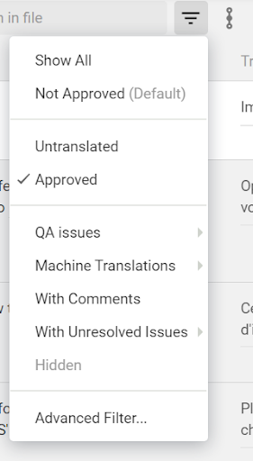

Features available in the right panel of the editor and described in the translation stage of this documentation such as commenting, and translation memory/glossary searching are available in the proofreading stage as well, so please refer to them as needed.

## Maintain or Update a Document Translation

After you complete a translation of a document, it is ideal if you can continue to maintain the translation as the document is changed and updated. Documents are updated when the software changes or when improvements and additions to the document are made.

If the translation progress bar for a previously completed document falls below 100%, it is likely that it has been updated and that the translation needs to be updated as well. Notifications will also be posted to Crowdin about known large updates to documentation in order to inform translators.

## Improve a Document Translation

If a document has already been translated but you think the translation needs to be improved, you can edit an existing translation.

Follow the instructions above under [Proofreading Documentation Translation](#proofreading-documentation-translation) to make direct changes and suggestions.

## Translate without Crowdin

If you do not want to use Crowdin to translate PKP documentation, your other option is to translate the markdown files, maintain markdown formatting, and submit your translation directly in the [pkp-docs repository](https://github.com/pkp/pkp-docs) in GitHub. Please note, this method is less preferred because the translation will need to be pulled into GitLocalize and the Translation Coordinator or a future translator will have to manually associate each translated segment of text with the original text.

To understand how documents in pkp-docs are structured and how to create and edit documents, read the [Guidelines for Contributing to PKP Documentation](/contributing/en/).

You can look at the structure of an already translated document, such as Learning OJS, to see how a GitHub-based translation will work.
