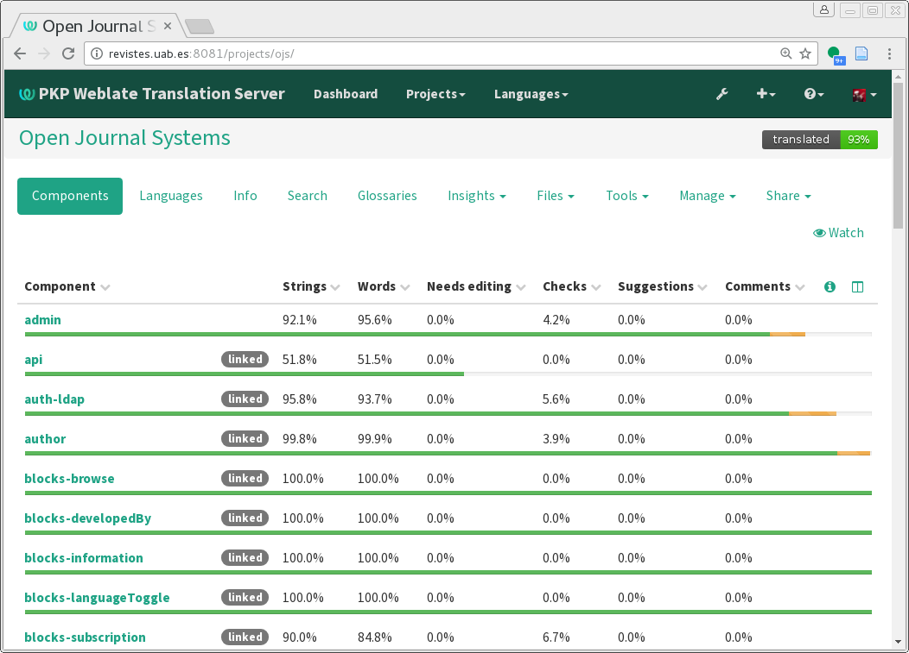
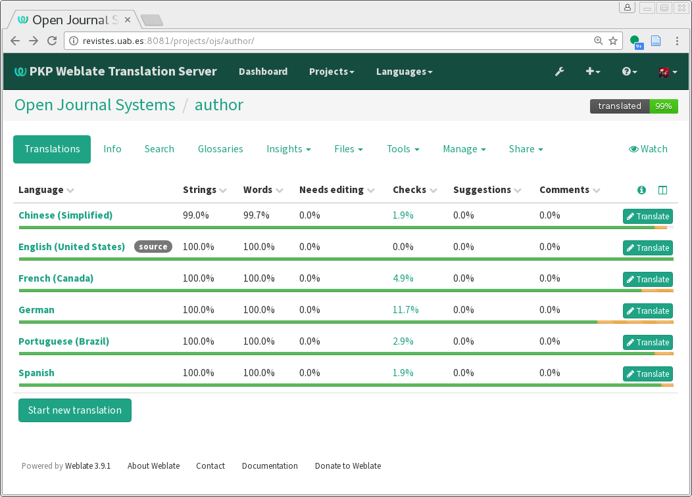
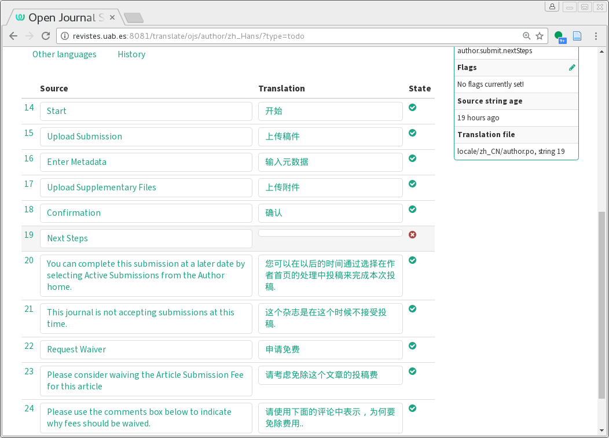

# Translate PKP Software

Translations for OJS, OMP, and OPS are  managed using the web-based translation tool [Weblate](https://weblate.org).

We use standard PO files for translations. PO files are widely used across many software projects and work well with modern translation tools. Our previous XML-based format and Translator plugin are no longer used.

If you prefer to use another translation tool, you can, but consider reaching out to PKP or other translators to coordinate your work and ensure it supports our PO file format.

## Get Started

So you want to translate OJS or OMP into another language! The PKP community depends on volunteer efforts to keep the system working well in many languages, so we appreciate your help and look forward to your contributions.

Begin by [registering for an account on PKP's Weblate installation](https://translate.pkp.sfu.ca).

Once you have registered and logged in, go to “Browse All Projects.” You will see a list of projects on the Weblate site:

## How Translation Content is Structured

Content is organized into **Projects**, **Components**, and **Strings**.

Key projects for software translation include:
* PKP Web Application Library: A shared library with text used by all PKP software.
* Open Journal Systems
* Open Monograph Press
* Open Preprint Systems

Additional projects available on Weblate include specific plugins.

Inside each **Project**, you may see many **Components**. Each file corresponds to a single .po file, which contains a set of texts related to some aspect of the system. For example, for the “Open Journal Systems” project:

The component name gives you some information about the context where those strings will be used. For example, “admin” relates to the site administration interface; “blocks-information” relates to the information block plugin. 

Inside each **component**, you will see numerous **strings**. These are the lines of text in the application that will need to be translated. We will demonstrate strings more thoroughly in the section about adding translations.

### Which Projects Do You Need to Translate?

It is important to understand that **translation of multiple projects is required to achieve a complete translation**. The PKP Web Application Library must be translated in addition to the project named after the specific software you're interest in. If your goal is to translate Open Journal systems, you will need to work with both “Open Journal Systems” and “PKP Web Application Library” projects to fully translate the software.

While it is possible to use the system without a 100% complete translation, you will see placeholders like ##author.submit.nextSteps## where translations are missing.

## Contributing Translations

Once you have registered for an account and gotten access to the projects, decide which projects or components you want to work on. 

Click on a component’s title to get started. You should see a list of languages along with the translation’s completeness:

If other volunteers have already worked on your language, you might look for projects or components that are not labelled as 100% translated. If your language does not appear on this list, you might add it.

To begin working, click the name of your language. If your language is not listed, click the "Start New Translation" button located at the end of the page and select your language from the list. (You should repeat this for any additional components you wish to translate.)

Once you click on the language, you'll be taken to the overview for that component. You can select which types of strings you wish to browse: all strings, all translated strings, unfinished strings, untranslated strings, and more. Any view marked in orange indicates that the translation still needs work or needs to be finalized.

Click on a view's name or the "Translate" link to jump to the translation view. Weblate will automatically step you through each of the each string that needs to be checked, corrected, or translated.

You will see the string's source text in English and a field to enter your translation below. You may also see translations for any other languages you selected as secondary languages when you registered for Weblate for your reference. 

Below the translation field, you'll see several tabs such as "Nearby strings" and "Similar keys". These can be useful for seeing what translations have been used for similar text. You can freely copy translations from these tabs using the "Copy" and "Clone to Translation" buttons and edit them to match the context of the current string. 

Similarly, the upper right corner may contain glossary entries for commonly used terms. Please use these glossary terms in your translation to ensure consistency.

Below the glossary is some contextual information about the string. In our example, we can see the key ID `admin.settings.enableBulkEmails.description`.

Enter your translation and choose "Save and continue". "Suggest" should only be used if you are not confident in your translation and require review. Continue until there are no strings left to translate.

When you have finished translating the remaining strings for this component, continue to the next.

### Updating or Correcting Existing Translations

If you have found an error in a translation, you can use the Weblate search feature to quickly locate the problematic string and change it. If you know which project the string belongs to, you can open that project and select the "Search" tab. If you're unsure where to locate the mistake, it is likely in either the PKP Web Application Library project, or the project dedicated to the software you found the error in, so you may need to search both.

Paste some or all of the erroneous text into the search and press "Search" to locate the string and make your changes. 

### Use Your New Translation

To learn how to use the new language you have translated the software into on your installation, see [the Install a Language instructions in this guide](./managing-languages.md#install-a-language).

