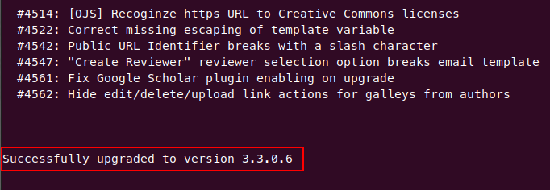

# Technical Upgrade Guide

## Introduction

This guide is a general (version non-specific) Open Journal Systems upgrade guide for technical staff. A list of required knowledge and tools is provided below. While this guide focuses solely on OJS and the LAMP stack, the information here can be adapted to suit other PKP products (i.e. OMP, OPS) and other stacks with some modifications.

If you are looking for more general information on version releases and related bug fixes, please check the [PKP Announcements](https://forum.pkp.sfu.ca/c/announcements/10) section of the forum.

## Required knowledge and tools

### PKP software version numbers

The versions of PKP applications use the “MAJOR.minor.revision-build” syntax, a variant of “[Semantic versioning](https://semver.org)”. See the [Administrator's guide](/admin-guide/) for more information.

The versions help to anticipate how complex an upgrade could be. The general rule is "the higher the update, the higher the risk", so it's a good idea keeping your system up to date.

For instance, on **patch** upgrades (as in 3.3.0-7 to 3.3.0-8) you are guaranteed to have no breaking changes or database migrations so it's a trivial task. On the other hand, an upgrade between **MAJOR** versions (as in 2.x to 3.x) involves comprehensive breaking changes that are likely to effect plugins, server configuration, and other parts of the system, so it will be more complex.

> <i class="fa fa-exclamation-circle"></i> **IMPORTANT**:
MAJOR upgrades are not always possible: For instance, a direct upgrade from 2.x to 3.3 (and later) are not supported; to upgrade from 2.x, you must first **upgrade to 3.2, and then to a later version**.
{:.warning}

### Environments and tools

- Basic GNU/Linux administration skills.
- Operating System and database credentials.
- LAMP (not all stacks will be covered).
- An OJS [release distributed by PKP](https://pkp.sfu.ca/ojs/ojs_download) (for example, tar/zip packages).
- Ability to access the server terminal (i.e: SSH).

### Notations

Each installation is different. Defined below are some variables that will be referenced in the commands in this guide.

| VARIABLE        | Default         | Description                    |
| --------------- | --------------- | ------------------------------ |
| SERVERNAME      | localhost       | Host's name                    |
| WEB_USER        | www-data        | Webserver user                 |
| WEB_GROUP       | www-data        | Webserver user's group         |
| OJS_ROOT_PATH   | /var/www        | OJS root folder                |
| OJS_WEB_PATH    | /var/www/html   | OJS web root folder            |
| OJS_DB_HOST     | db              | Database host's name           |
| OJS_DB_USER     | ojs             | Database user                  |
| OJS_DB_PASSWORD | ojsPwd          | Database password              |
| OJS_DB_NAME     | ojs             | Database name                  |
| OJS_BACKUP_PATH | /srv/backup/ojs | Folder to store your backups   |
| OJS_VERSION     | ojs-3.3.0-8     | Version as in the ojs filename |

## Step-by-step process

### 1. Set your environment variables

Adapt the environment variables to suit your installation. If you like, you can copy and paste these commands, replacing the variables with your own:

```bash
$ SERVERNAME="localhost" && \
WEB_USER="www-data" && WEB_GROUP="www-data" && \
OJS_ROOT_PATH="/var/www" && OJS_WEB_PATH="/var/www/html" && \
OJS_DB_HOST="db" && OJS_DB_USER="ojs" && OJS_DB_PASSWORD="ojsPwd" && \
OJS_DB_NAME="ojs" && OJS_BACKUP_PATH="/srv/backup/ojs" && \
OJS_VERSION="ojs-3.3.0-8" && OJS_PUBLIC_PATH="$OJS_WEB/public" && \
OJS_PRIVATE_PATH="$OJS_ROOT/files"
```

### 2. Put the site into maintenance mode

If possible, do an Apache vhost redirection.

#### 2.1. Setup Apache vhost redirection

Modify your Apache `VirtualHost` directive, or create an .htaccess file in your webroot with the following content:

```bash
order deny,allow
deny from all 
ErrorDocument 403 "OJS server in maintenance mode"
```

#### 2.2. Reload Apache

Reload the apache server to apply the changes:

```bash
(Debian)$ service apache2 reload

(RHEL)$ systemctl restart httpd
```

> <i class="fa fa-info-circle"></i> **INFORMATION**:
Does OJS include a "maintenance mode" feature?
Well, not yet but [we are on our way](https://github.com/pkp/pkp-lib/issues/3263)...
{:.notice}

### 3. Backup existing install

> <i class="fa fa-exclamation-circle"></i> **DO NOT SKIP THIS STEP**:
Upgrading your installation will make changes to your database and filesystem. If any change fails, a backup will be *required* to revert to the older version, or to retry the upgrade. Data integrity errors, mistakes in the upgrade process, and many things outside of your control (like software bugs or connection failures) can cause an upgrade failure. **Backing up your existing install is essential.**
{:.warning}

The folders and files that need to be backed up are:

| Element                            | Usual path                   | VARIABLE         |
| ---------------------------------- | ---------------------------- | ---------------- |
| public files                       | /var/www/html/public         | OJS_PUBLIC_PATH  |
| private files                      | /var/www/files               | OJS_PRIVATE_PATH |
| config.inc.php                     | /var/www/html/config.inc.php |                  |
| .htaccess or vhost (if any)        | /var/www/html/.htaccess      |                  |
| plugins (if you have special ones) | /var/www/html/plugins        |                  |
| local personalizations (if any)    | locale files, custom code, etc. |                  |

#### 3.1. Backup your database

```bash
$ mysqldump --host="OJS_DB_HOST" -u $OJS_DB_USER -p$OJS_DB_PASSWORD $OJS_DB_NAME --result-file="$OJS_BACKUP_PATH/backupDB-date.sql"
```

> <i class="fas fa-check-square"></i> **TIP**:
> Problems with character encoding are common. The [Administrator Guide](/admin-guide/en/troubleshooting#character-encoding) includes a section explaining why it happens and how it can be addressed.
>
> But this is not an OJS exclusive issue, so you can find good guides online, including:
>
> - [Character encodings: Essential concepts](https://www.w3.org/International/articles/definitions-characters)
> - [The Ultimate Guide To UTF-8 and MySQL](https://jonisalonen.com/2012/ultimate-guide-to-utf8-and-mysql)
> - [Breaking out from the MySQL character-set hell](https://manish-demblani.medium.com/breaking-out-from-the-mysql-character-set-hell-24c6a306e1e5)
{:.tip}

#### 3.2. Backup private files

```bash
$ tar cvzf "$OJS_BACKUP_PATH/private-date.tgz" "$OJS_PRIVATE_PATH"
```

#### 3.3. Backup public, special files, and former code

```bash
$ tar cvzf "$OJS_BACKUP_PATH/ojsfiles-date.tgz" "$OJS_WEB_PATH"
```

> <i class="fas fa-check-square"></i> **TIP**:
If possible, use your backup to create a sandbox environment and test the upgrade in that sandbox first.
{:.tip}

### 4. Download updated release

```bash
$ cd "$OJS_ROOT_PATH"
$ wget "https://pkp.sfu.ca/ojs/download/$OJS_VERSION.tar.gz"
```

### 5. Check your system

Check your [README](https://pkp.sfu.ca/ojs/README) file from the downloaded tar.gz and be sure your system meets the requirements:

- Check your Apache version.
- Check your version of MySQL or PostgreSQL.
- Check your PHP version.
- Adjust your PHP timeouts and memory limits to ensure the upgrade process can successfully complete.
- Check your libraries and module requirements (e.g. in the README file).
- Check libraries and module requirements for plugins you've added (e.g. in the plugin README file).

### 6. Upgrade the code

Move your current installation:

```bash
$ mv "/$OJS_WEB_PATH" "/$OJS_BACKUP_PATH"
```

Extract the latest OJS code:

```bash
$ mkdir "$OJS_WEB_PATH"
$ tar -xvz --strip-components=1 "$OJS_VERSION.tar.gz" -C "$OJS_WEB_PATH"
```

Copy your customized config.inc.php and .htaccess (if added):

```bash
$ cp "$OJS_BACKUP_PATH/html/config.inc.php" "$OJS_WEB_PATH"
$ cp "$OJS_BACKUP_PATH/.htaccess" "$OJS_WEB_PATH"
```

Compare your OJS configuration file with the version of the new release:

```bash
$ diff $OJS_BACKUP_PATH/config.inc.php" $OJS_WEB_PATH/config.TEMPLATE.inc.php"
```

> <i class="fas fa-check-square"></i> **TIP**:
You would probably also like to review `docs/release-notes`. This document explains important changes introduced in the version like changes to the configuration file. See `config.TEMPLATE.inc.php` for a description and examples of all supported configuration parameters.
{:.tip}

Copy your public files:

```bash
$ cp -r "$OJS_BACKUP_PATH/html/public/*" "$OJS_PUBLIC_PATH"
```

Change permissions if required by your server configuration:

```bash
(Debian)$ sudo chown -R nobody:www-data /var/www/html/public/ /var/www/html/cache/

(RHEL)$ sudo chown -R apache:apache /var/www/html/public/ /var/www/html/cache/
```

Change permissions if plugin installation from the web is required:

```bash
(Debian)$ sudo chown -R nobody:www-data/var/www/html/plugins/

(RHEL)$ sudo chown -R apache:apache /var/www/html/plugins/
```

If running under SElinux, reset file contexts:

```bash
(RHEL)$ sudo restorecon -R /var/www/html/
```

Remove the original copy of the old installation:

```bash
$ sudo rm -fR /tmp/html/
```

### 7. Run the upgrade process

> <i class="fa fa-info-circle"></i> **INFORMATION**:
Depending on your journal data size and version change, an upgrade could take anything from a few minutes to several hours.
{:.notice}

Although OJS offers 2 ways to upgrade (command-line and web-based), the web-based upgrade tool should be avoided in most cases and **OJS should be upgraded using the command-line**.

Command-line will be more verbose, easier to monitor, and you will have more control over things like timeouts and memory issues, so this is the method covered by this guide.  

#### 7.1 Check your versions

Confirm version numbers are as expected with:

```bash
$ php tools/upgrade.php check
```


#### 7.2 Run the upgrade script

Run the upgrade script:

```bash
$ php tools/upgrade.php upgrade
```

If the upgrade is successful, you will get a "Successfully upgraded" message.



> <i class="fas fa-check-square"></i> **TIP**:
> The output will be extensive, so we recommend running the upgrade and logging the output of the process. This will help you troubleshoot if the upgrade fails:
> 
> ```$ nohup php tools/upgrade.php upgrade > $OJS_ROOT_PATH/upgrade.log &```
> 
> If you want to check the progress while the upgrade is running:
> 
>```$ tail -f $OJS_ROOT_PATH/upgrade.log```
{:.tip}

#### 7.3 Read your logs

Review the output of the upgrade script.

Unset the maintenance redirect, if set earlier:

```bash
$ cd /var/www/html/
$ mv .htaccess .htaccess.disabled
```

And reload the apache server again to apply the changes:

```bash
(Debian)$ service apache2 reload

(RHEL)$ systemctl restart httpd
```

### 8. Verify the upgrade

* A checklist of actions to verify if all went well.

    1. Visit your OJS frontend and check
        - The homepage loads
        - Theme loads correctly
        - Published articles can be downloaded
        - Characters are displaying correctly
        - No timeouts or long delays
        - No broken links
        - Run a search and check that articles are indexed
    2. Check your database
        - Charset and collation on database, tables and fields
        - Database engine is innoDB for database and all tables (if using MariaDB/MySQL)
    3. Check your web server
        - Remove the temporary vhost redirection
        - Roll back PHP timeouts and memory limits back to normal
    4. Register a new user account and login
        - As a Visitor:
            - Register a new user (as author)
            - Get a registration email
            - Login with the new user
    5. Complete a full workflow
        - As a Journal Manager:
            - Create a new testing journal
            - Register your new user as an author in the testing journal
        - As an Author:
            - Login as author and submit an article to a test journal
            - Confirm you are able to upload a document
        - As an Editor:
            - Assign the article to a section
            - Accept article without revision
            - Create a new issue and assign the article to it
            - Publish the issue
            - Download the published article
            - Unpublish the article and remove the issue
    6. User management
        - As a Journal manager:
            - Assign new roles to the new user
            - Change new user's profile data and password
            - Remove the new user by merging it to your admin account
    7. Additional testing of common tasks

### 9. Re-add custom plugins

Use the Plugin Gallery to re-add any custom plugins you had previously used.

If you have installed custom plugins which are not in the Plugin Gallery, check with the plugin distribution for an update which is compatible with your upgraded version.

## Troubleshooting

If you encounter problems, the following resources are available for troubleshooting.

* [PKP Forum](https://forum.pkp.sfu.ca/) - Search and post questions and answers with other software users
* [FAQ](https://docs.pkp.sfu.ca/faq/en/) - See the "Errors and Troubleshooting" section in the Frequently Asked Questions
* [Administrator Guide - Troubleshooting](https://docs.pkp.sfu.ca/admin-guide/en/troubleshooting) - See the "Troubleshooting" section in the Administrator's Guide
* [GitHub Issues](https://github.com/pkp/pkp-lib/issues) - Review known issues reported against versions of the software
