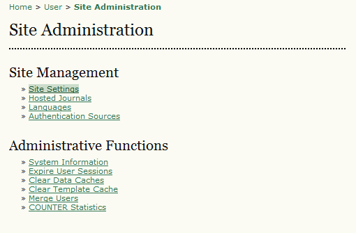
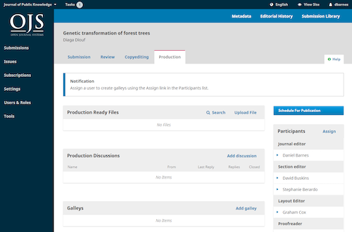
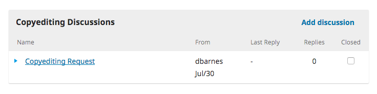

# Diferencias entre OJS 2 y OJS 3

Aunque las características fundamentales de OJS son consistentes entre las versiones, hay algunos cambios y mejoras significativas en OJS 3. Las nuevas características en OJS 3 incluyen lo siguiente, algunas de las cuales se explican con más detalle a continuación:

- Diseño adaptable y optimizado para dispositivos móviles
- Nuevos temas
- Flujo de trabajo editorial flexible
- Integración de módulos con ORCID, iThenticate, Publons y otros servicios externos
- Registro de usuarios/as simplificado
- Roles y permisos personalizables
- Informes internos y estadísticos de uso ampliados
- Soporte multilingüe para nombres de autor/a
- Soporte para colecciones temáticas o categorías de artículos

## Interfaz de OJS 3

Hay una nueva interfaz para lectores/as y editores/as que incluye una interfaz editorial distinta visualmente a la de la revista. Los usuarios/as con múltiples roles ya no están obligados a seleccionar un rol desde el área personal de su página de inicio para acceder a ciertas configuraciones o funciones administrativas. Todas las opciones disponibles se pueden localizar en el nuevo panel de instrumentos. Esto también permite un cambio continuo entre tareas asociadas a diferentes roles. La nueva interfaz se muestra a continuación y se explica en [Novedades de OJS 3](https://docs.pkp.sfu.ca/learning-ojs/es/introduction#novedades-en-ojs-31) .

 | 
:---: | :---:
Menú de configuración de OJS 2 después de seleccionar el rol de administrador/a del sitio | Panel de OJS 3 con menús de configuración en el panel izquierdo

## Flujo de trabajo de OJS 3

El flujo de trabajo editorial de OJS 3 se ha mejorado significativamente para que sea más flexible, lo que puede significar un gran cambio para sus editores/as. OJS 3 consta de 4 etapas editoriales, y cualquiera de ellas se puede omitir fácilmente:

1. Envío, en la que se tratan los envíos nuevos (rechazados, asignados a editores/as de sección, etc.)
2. Revisión, en la que tienen lugar la revisión por pares y las revisiones de los autores
3. Edición, en la que los archivos revisados se envían para su corrección
4. Producción, en la que la versión final editada se convierte a formatos publicables (PDF, HTML, etc.), se revisa y se programa para su publicación.

Otra nueva característica editorial es la introducción de una función de discusión interna para cada etapa editorial (Envío, Revisión, Edición, Producción). Estas discusiones funcionan de manera muy similar a un foro en línea: un usuario/a crea un tema de discusión, invita a otras personas a participar y les envía un mensaje con archivos adjuntos relevantes.

## Estadísticas

El tipo de informes estadísticos disponibles y la forma en que se generan es otro cambio clave entre las versiones. Si su revista utiliza informes estadísticos, lea la [Guía de estadísticas](https://docs.pkp.sfu.ca/admin-guide/en/statistics), que explica los diversos tipos de informes disponibles en cada versión y proporciona información sobre cómo actualizar las revistas con datos heredados de Ver informe.

OJS 3 tiene nuevas características estadísticas, como un panel visual de estadísticas de uso para editores/as y administradores/as de revistas, y la capacidad de mostrar las estadísticas de uso de un artículo en la parte pública para el lector.

## Características descartadas

También hay algunas características de OJS 2 que se han descartado o que aún están en desarrollo para OJS 3, incluidas las siguientes:

- Algunos módulos no se han portado a OJS 3, entre ellos Books for Review y Dataverse
- La administración de plantillas de correo electrónico y la administración de notificaciones de usuario/a aún se están perfeccionando
- La funcionalidad de pagos y suscripciones está menos desarrollada y algunas funciones no están disponibles, incluidas las donaciones

Es importante hacer un inventario de sus módulos y características más útiles y más utilizados y comprobar la disponibilidad en la versión más reciente de OJS antes de decidir actualizar.

Por último, las actualizaciones y desarrollos de OJS 3 siguen en curso. Si no está seguro sobre el estado de una característica o módulo en OJS 3, busque en el [Foro de la comunidad](https://forum.pkp.sfu.ca/) y en el [repositorio Github de PKP](https://github.com/pkp/pkp-lib/issues) para ver si se está trabajando activamente en ello. También puede solicitar nuevas funciones o cambios en funciones ya existentes, que mejorarán OJS.

Para obtener recursos adicionales sobre las diferencias entre OJS 2 y OJS 3, consulte la sección "Recursos adicionales" al final de esta guía.
