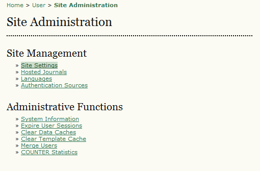
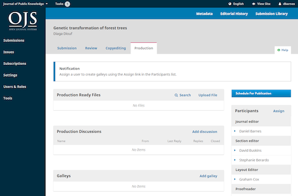

# Perbedaan antara OJS 2 dan 3

Meskipun fitur dasar OJS konsisten di setiap versinya, terdapat beberapa perubahan dan perbaikan signifikan pada OJS 3. Fitur-fitur terbaru di OJS 3 meliputi hal-hal berikut, beberapa di antaranya dijelaskan secara lebih rinci di bawah ini:

* Desain responsif dan mudah digunakan di perangkat seluler
* Themes terbaru
* Alur kerja editorial yang fleksibel
* Integrasi plugin dengan ORCID, iThenticate, Publons, dan layanan eksternal lainnya
* Registrasi pengguna yang disederhanakan
* Peran dan izin yang dapat disesuaikan
* Laporan statistik penggunaan dan laporan internal yang diperluas
* Dukungan untuk nama penulis multibahasa
* Dukungan untuk koleksi tematik atau kategori artikel

Untuk cuplikan fitur-fitur yang dapat anda nantikan di OJS 3, dapat dilihat di video berikut ini [OJS 3 Features Overview](https://www.youtube.com/watch?feature=player_embedded&v=UFkEj2kXd-0&list=PLg358gdRUrDX7Ai8HcN2vqPM1g0HHG7nu).

## Antarmuka OJS 3

Terdapat antarmuka (interface) baru untuk pembaca dan editor, termasuk antarmuka editorial terpisah yang secara visual berbeda dari jurnal. Pengguna dengan beberapa peran tidak lagi diharuskan memilih peran dari homepage pengguna mereka untuk mengakses pengaturan atau fitur administratif tertentu; semua opsi yang tersedia dapat ditemukan di dasbor terbaru. Hal ini juga memungkinkan proses peralihan yang lancar antara tugas yang terkait dengan peran yang berbeda. Antarmuka terbaru diilustrasikan di bawah ini dan dijelaskan dalam [What's New in OJS 3](https://docs.pkp.sfu.ca/learning-ojs/3.2/en/introduction#whats-new-in-ojs-3).

|            |     |
|:---------------------------------------------------------------:|:---------------------------------------------------------:|
| Menu pengaturan OJS 2 sesudah memilih peran administrator situs | Dasbor OJS 3 dengan menu pengaturan di panel sebelah kiri |

## Alur kerja OJS 3

Alur kerja editorial di OJS 3 telah diubah secara signifikan agar lebih fleksibel, yang dapat menjadi penyesuaian besar bagi editor anda. OJS 3 terdiri dari 4 tahap editorial, yang dapat dengan mudah dilewati:

1. Submission, tempat artikel baru masuk (ditolak, ditugaskan ke section editor, dll.)
2. Review, tempat dimana review dan revisi penulis berlangsung
3. Penyuntingan naskah, tempat file yang di-review dan direvisi dikirim untuk penyuntingan naskah
4. Produksi, tempat versi final, naskah yang disunting diubah menjadi format yang dapat dipublikasikan (PDF, HTML, dll.), diperiksa, dan dijadwalkan untuk diterbitkan.

Fitur editorial terbaru lainnya adalah pengenalan fitur diskusi internal untuk setiap tahap editorial (Submission, Review, Penyuntingan Naskah, Produksi). Diskusi ini bekerja seperti forum daring — pengguna membuat topik diskusi, mengundang orang lain untuk berpartisipasi, dan mengirim pesan dengan lampiran yang relevan.

## Statistik

Jenis laporan statistik yang tersedia dan cara pembuatannya merupakan perubahan penting lainnya dibandingkan dengan versi sebelumnya. Jika jurnal anda menggunakan laporan statistik, baca [Statistical guide](https://docs.pkp.sfu.ca/admin-guide/en/statistics), yang menjelaskan berbagai jenis laporan yang tersedia di setiap versi dan menyediakan informasi tentang upgrade jurnal dan dapat melihat data laporan sebelumnya pada View Report Data.

OJS 3 memiliki fitur statistik baru seperti dasbor visual statistik penggunaan untuk editor dan journal manager serta dapat menampilkan statistik penggunaan artikel pada antarmuka pembaca.

## Fitur-fitur yang hilang

Terdapat juga beberapa fitur dari OJS 2 yang hilang atau masih dalam tahap pengembangan untuk OJS 3, termasuk beberapa hal berikut ini:

* Beberapa plugin belum dipindahkan ke OJS 3, termasuk Books for Review dan Dataverse
* Pengaturan templat email dan notifikasi pengguna masih dalam tahap penyempurnaan

Penting untuk membuat inventaris plugin dan fitur yang berguna dan sering digunakan serta ketersediaannya untuk versi OJS yang lebih baru sebelum memutuskan untuk melakukan upgrade.

Terakhir, pembaruan dan pengembangan OJS 3 masih berlangsung. Jika anda tidak yakin tentang status fitur atau plugin di OJS 3, anda dapat mencari di [PKP Community Forum](https://forum.pkp.sfu.ca/) dan [PKP’s Github repository](https://github.com/pkp/pkp-lib/issues) untuk melihat apakah fitur atau plugin tersebut sedang aktif dikerjakan. Anda juga dapat meminta fitur terbaru atau penyempurnaan pada fitur yang akan semakin menyempurnakan OJS.

Untuk referensi tambahan tentang perbedaan antara OJS 2 dan 3, lihat bagian Referensi Tambahan di akhir panduan ini.
