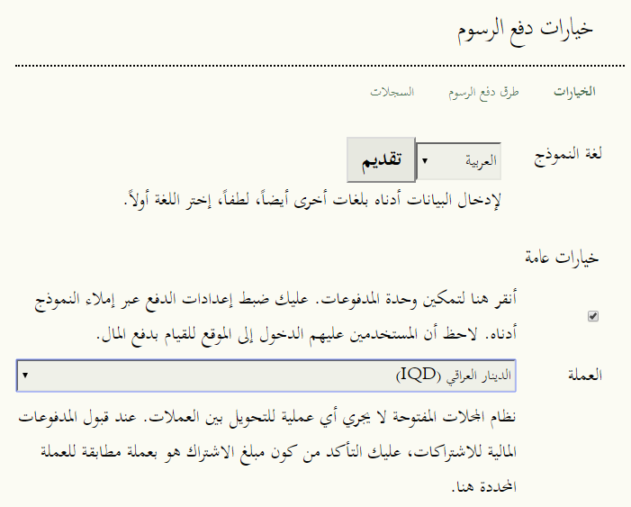
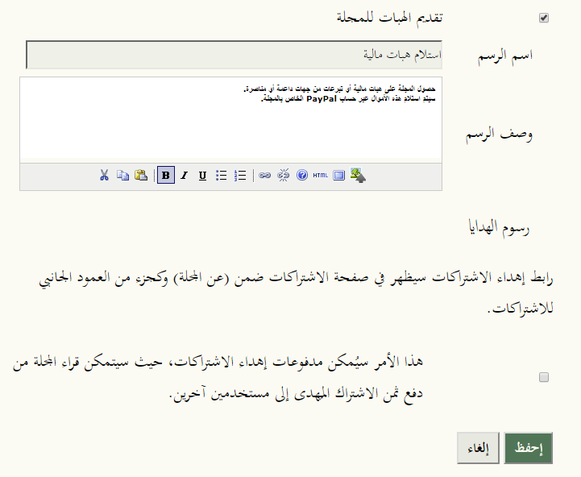
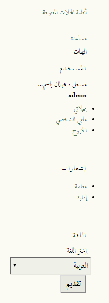
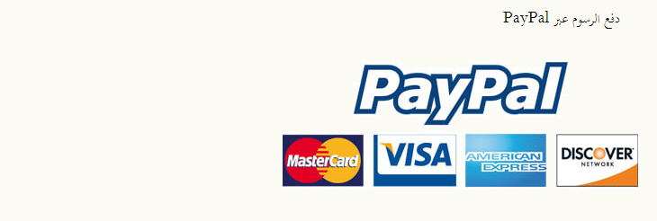
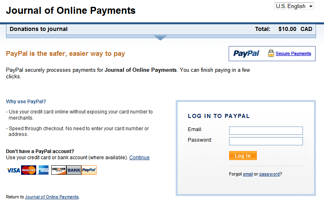
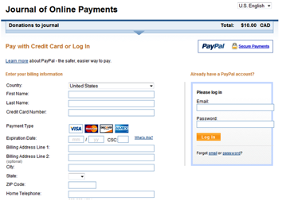
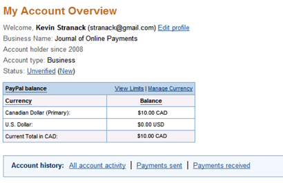

# تهيئة نظام المجلات المفتوحة

الآن وقد أنشأت حسابك في PayPal، عليك تفعيل طريق الدفع لديك في نظام المجلات المفتوحة. للقيام بذلك، سجل دخولك إلى الموقع بصفة رئيس التحرير، ثم اختر المدفوعات. ضمن الخيارات العامة، إختر العملة:

بعدها، إختر أنواع المدفوعات التي تريد فرضها في مجلتك. قد تتضمن هذه رسوم طلبات التقديم، رسوم التحكيم المناظر العاجلة، رسوم نشر المقالات، رسوم الاشتراك، رسوم المعاينة عند الدفع، رسوم العضوية، أو كما في المثال أدناه، الهبات:

هذا من شأنه أن ينشئ رابط الهبات في الشريط الجانبي **إذا** سبق لك تنصيب المكتبة البرمجية PHP libcurl، و **إذا** لم تقم بتغيير الوضع الافتراضي لإعداد نظام المجلات المفتوحة Home &gt; المستخدم &gt; إدارة المجلة &gt; إعدادات المجلة \(ثم اختر الخطوة "5. المظهر" وتحقق بأن الفقرة 5.6 تتضمن 'كتلة الهبات' ولا تزال متوضعة في الشريط الجانبي\):

عندما يعمد القراء إلى النقر على رابط الهبات، سيذهب بهم الموقع إلى صفحة رسوم الدفع عبر PayPal:

بعد النقر على زر الاستمرار، سيذهب القارئ مباشرة إلى موقع PayPal، حيث يمكنه تحديد مبلغ التبرع \(مثلاً, 10000\) ومن ثم التسديد مستعملاً بطاقة رصيد نافذة أو عبر حسابه الشخصي في PayPal:

إذا اخترت استعمال بطاقة رصيد، سيكون عليه تعبئة النموذج الآتي:

بمجرد إكتمال الدفع، سيعود به الموقع إلى المجلة أو المؤتمر. سجل الدفع سيظهر لك عند معاينة مدفوعات حسابك في PayPal:

