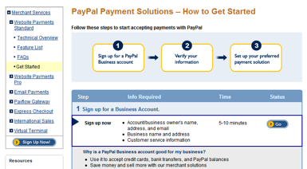
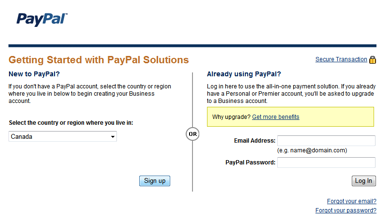
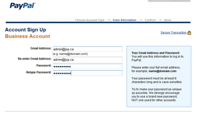
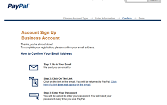
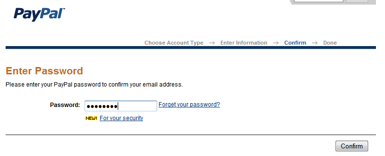
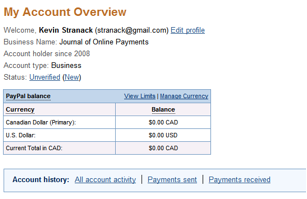

تهيئة حساب دفع قياسي عبر موقع PayPal:

[https://www.paypal.com/us/cgi-bin/webscr?cmd=\_onboarding-list&getStarted=true](https://www.paypal.com/us/cgi-bin/webscr?cmd=_onboarding-list&getStarted=true)

أنقر زر Go. إذا كان لديك مسبقاً حساب في PayPal، سجل دخولك الآن. إذا لم يكن، إختر بلدك:

قم بتعبئة النموذج الآتي:

عبئ كل النماذج ثم احفظ. بعدها أنشئ حساب الأعمال الخاص بك:

أكد تسجيلك مستعملاً بريدك الالكتروني:

بمجرد تأكيدك لبريدك، إذهب إلى معاينة حسابك:

مستعملاً رابط "غير مؤكد"، إذهب مباشرة وتحقق من حسابك.

بعدها، من معاينة حسابك، إختر رابط تعديل الملف الشخصي.

في صفحة الملف الشخصي، إختر التفضيل المتعلق بالإشعار الفوري للدفع.

إستعمل زر التعديل لتفعيل إشعار الدفع الفوري \(IPN\).

ضع تأشيرة في خانة الاختيار ثم أضف الرابط أدناه \(ستجد هذا الرابط أيضاً عند تهيئة طرق الدفع في نظام المجلات المفتوحة أو نظام المؤتمرات المفتوحة\).
