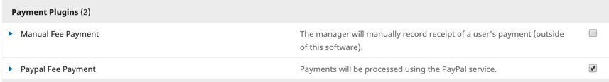
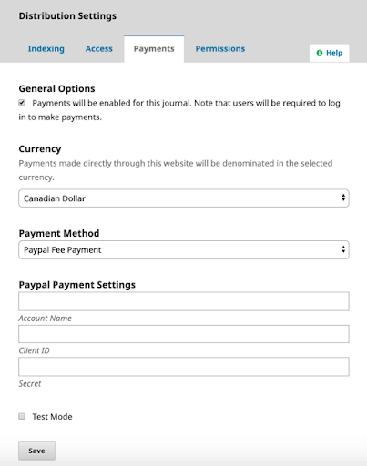
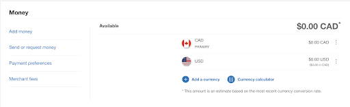

# Test PayPal plugin in OJS

To test your PayPal plugin, you will need to enable this  in OJS or OMP. 

## Enable the PayPal plugin
Go to Website Settings > Plugins > Installed Plugins and find the PayPal Fee Payment plugin. Check the box next to the plugin to enable it. If you also plan to collect manual fees you can enable the Manual Fee Payment plugin as well.

## Set up payments
Please see [Learning OJS](https://docs.pkp.sfu.ca/learning-ojs/en/settings-distribution#payments) for how to enable payments. Ensure that you select **Paypal Fee Payment** as a **Payment Method**. After you select Paypal Fee Payment, fields will appear below for _*Account Name**, **Client ID**, and **Secret**_. Follow the instructions in the [PayPal documentation](https://developer.paypal.com/docs/integration/admin/manage-apps/#create-or-edit-sandbox-and-live-apps) to generate the credentials to enter into the OJS fields. Make sure to check off the box for Test Mode before saving. 

Next, go to the [Subscriptions chapter](https://docs.pkp.sfu.ca/learning-ojs/en/subscriptions.html) in Learning OJS 3 and follow the instructions to set up your payment types and subscription types, if applicable.

## Test Transactions 
Using the pretend PayPal accounts, make test payments to the site. Once the payment is complete, the user will return to the journal or conference. The payment will appear in your PayPal Account Overview:

