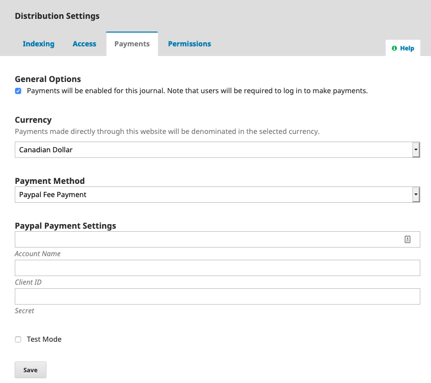

# Configure OJS

Now that you have setup your PayPal account, you will need to activate your payment methods in OJS.

## OJS 3.x

Under Settings > Website > Plugins, enable the Paypal Fee Payment plugin in the Plugin Gallery.

Under Settings > Distribution > Payments, check the box to enable payments, select your preferred currency, and choose "PayPal Fee Payment" as the Payment Method.

Enter your credentials under the Paypal Payment Settings. Check the box for Test Mode if you are only testing the plugin.

For more information about payments in OJS 3 [see the Learning OJS 3 guide](https://docs.pkp.sfu.ca/learning-ojs/en/settings-distribution#payments).

## OJS 2.x

Login as the Journal Manager, and select Payments. Under General Options, choose your currency:

Next, select the kind of payments you wish to charge on your site. These could include author submission fees, fast-track peer review fees, article publication fees, subscription fees, pay-per-view fees, membership fees, or, as in the example below, donations:

This will create a DONATION link in the sidebar **if** you have installed the PHP libcurl library, and **if** you have not changed the default in your OJS Home &gt; User &gt; Journal Management &gt; Journal Setup \(then choose "5. The Look" and check that 5.6 has the 'Donation Block' still in the right sidebar\):

When readers select the DONATION link, they will be taken to the PayPal Fee Payment page:

After clicking Continue, the reader will be taken directly to PayPal, where they can select their donation amount \(e.g., $10.00\) and pay using a credit card or with their own PayPal account:

If they choose to use a credit card, they will need to fill in the resulting form:

Once the payment is complete, they will return to the journal or conference. The payment will appear in your PayPal Account Overview:

