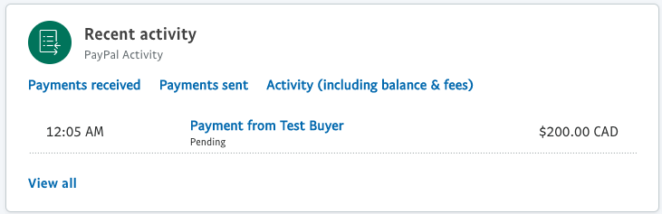

# Use Your Real PayPal Account

Once you’ve confirmed that payments from the pretend accounts are successful, you can now enable the PayPal Account.

First,  you’ll need to change your need to change your PayPal API app from Sandbox to Live. To get Live API Credentials, go to Tools > Business Setup > Offer PayPal checkout on your website. Click **Set Up Online Payments** followed up **Get Your API Credentials**

Next, you’ll need to update the PayPal information on your OJS distribution setting with live API credentials and unselect ‘Test Mode’

